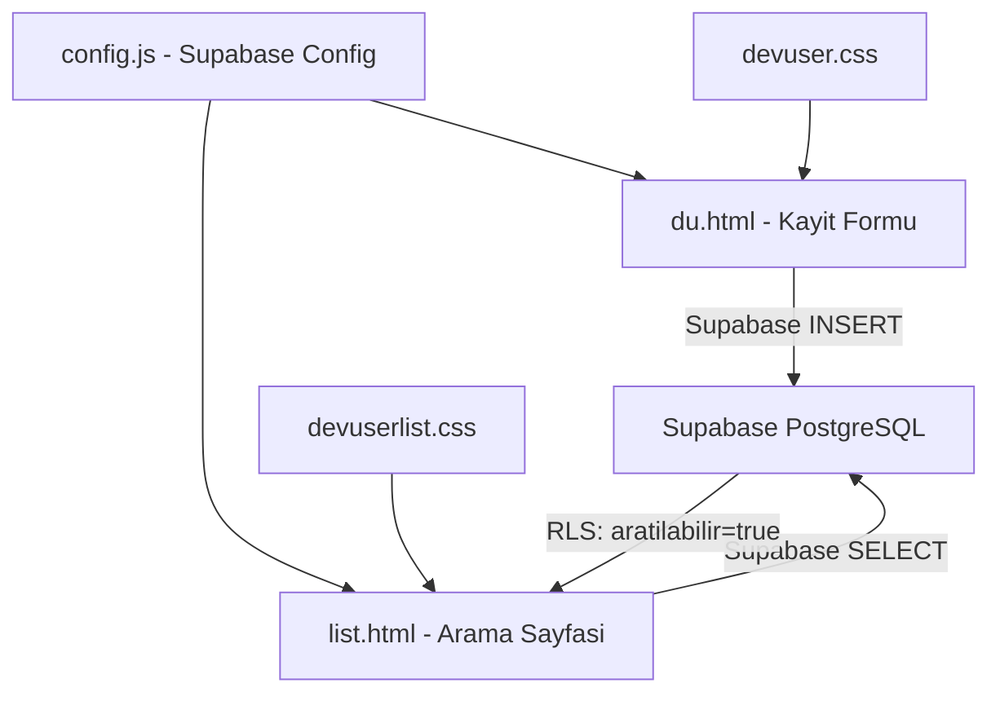

# DevUser Proje Analizi

## 📋 Genel Bakış

**Proje:** DevUser - Almanya'daki Türk developer, QA, DevOps ve tech profesyonelleri için topluluk platformu  
**Domain:** almanya101.de/devuser/  
**Backend:** Supabase (PostgreSQL + RLS)  
**Frontend:** Vanilla HTML/CSS/JS (framework yok)  
**Durum:** MVP aşamasında, çalışır durumda

---

## 🏗️ Mimari

---

## 📁 Dosya Yapısı

| Dosya | Satır | Açıklama |
|-------|-------|----------|
| `du.html` | 1076 | Kayıt formu - 30 adımlı wizard |
| `list.html` | 339 | Üye arama ve filtreleme sayfası |
| `devuser.css` | 421 | Kayıt formu stilleri |
| `devuserlist.css` | 373 | Arama sayfası stilleri |
| `config.js` | 7 | Supabase URL ve anon key |
| `README.md` | 110 | Proje dokümantasyonu |
| `KURULUM.md` | 164 | Kurulum talimatları |
| `du.html.backup` | - | Yedek dosya |
| `list.html.backup` | - | Yedek dosya |

---

## 🔍 Detaylı Analiz

### 1. Kayıt Formu - `du.html`

**Yapı:** 30 adımlı tek sayfa wizard form  
**Supabase Entegrasyonu:** CDN üzerinden `@supabase/supabase-js@2`

**Toplanan Veriler (30 soru):**

| # | Alan | Tip | Zorunlu |
|---|------|-----|---------|
| 1 | ad_soyad | text | ✅ |
| 2 | linkedin_url | url | ❌ |
| 3 | whatsapp_tel | tel | ❌ |
| 4 | yasam_yeri | radio + conditional | ✅ |
| 5 | sehir | text | ✅ |
| 6 | rol | select | ✅ |
| 7 | deneyim_seviye | select | ✅ |
| 8 | aktif_kod | radio boolean | ✅ |
| 9 | guclu_alanlar | checkbox array | ❌ |
| 10 | acik_kaynak | radio boolean | ❌ |
| 11 | kendi_proje + proje_link | radio + conditional | ❌ |
| 12 | programlama_dilleri | checkbox array | ❌ |
| 13 | framework_platformlar | checkbox array | ❌ |
| 14 | devops_cloud | checkbox array | ❌ |
| 15 | ilgi_konular | checkbox array | ❌ |
| 16 | ogrenmek_istenen | checkbox array | ❌ |
| 17 | is_arama_durumu | select | ✅ |
| 18 | ai_app_builders | checkbox array | ❌ |
| 19 | freelance_aciklik | select | ✅ |
| 19* | gonullu_proje | radio boolean | ❌ |
| 20 | katilma_amaci | select | ✅ |
| 21 | isbirligi_turu | checkbox array | ❌ |
| 22 | profesyonel_destek_verebilir | radio boolean | ❌ |
| 23 | profesyonel_destek_almak | radio boolean | ❌ |
| 24 | aratilabilir | radio boolean | ✅ |
| 25 | iletisim_izni | radio boolean | ✅ |
| 26 | kullanilan_ide | checkbox array | ❌ |
| 27 | kullanilan_agent | checkbox array | ❌ |
| 28 | ek_notlar | textarea | ❌ |
| 29 | veri_paylasim_onay | radio boolean | ✅ |

### 2. Arama Sayfası - `list.html`

**Filtreler:** 6 adet (şehir, rol, deneyim, iş arama durumu, teknoloji, ilgi alanı)  
**Filtreleme Mantığı:** OR logic - herhangi bir filtre eşleşirse gösterir  
**Kart Bilgileri:** Ad, rol, badge'ler, şehir, deneyim, güçlü alanlar, tech stack, ilgi alanları, LinkedIn/WhatsApp butonları

### 3. Config - `config.js`

- ES module export kullanıyor
- Supabase project ID: `ldptefnpiudquipdsezr`
- Anon key açık şekilde frontend'de

---

## 🐛 Tespit Edilen Sorunlar ve İyileştirme Alanları

### Kritik Hatalar

1. **Duplicate data-step="19"** - `du.html` satır 593 ve 604'te iki farklı soru aynı step numarasını paylaşıyor. Freelance sorusu ve gönüllü proje sorusu ikisi de `data-step="19"`. Bu, `querySelector` ile sadece ilk eşleşeni bulacağından gönüllü proje sorusu hiç gösterilmiyor.

2. **totalSteps=30 ama sadece 29 step var** - Form `totalSteps = 30` olarak ayarlanmış ama HTML'de `data-step="29"`'a kadar gidiyor. Step 30 mevcut değil, bu yüzden son adımda boş bir sayfa gösterilecek ve submit butonu orada çıkacak.

3. **config.js module uyumsuzluğu** - `config.js` ES module `export` kullanıyor ama `du.html` bunu `<script src="config.js">` ile normal script olarak yüklüyor. Bu tarayıcıda `Unexpected token 'export'` hatası verecektir. `list.html` ise doğru şekilde `import` ile kullanıyor.

4. **`almanya_yasam` alanı formda yok** - `submitForm()` fonksiyonunda `almanya_yasam` boolean olarak işleniyor ama formda bu isimde bir alan yok. `yasam_yeri` var ama `almanya_yasam` yok.

5. **`veri_paylasim_onay` boolean olarak işlenmiyor** - Submit fonksiyonundaki boolean dönüşüm listesinde `veri_paylasim_onay` yok, string olarak gönderilecek.

### Orta Seviye Sorunlar

6. **XSS koruması eksik (kayıt formunda)** - `list.html`'de `escapeHtml()` fonksiyonu var ama form gönderiminde input sanitization yok. Supabase RLS bunu kısmen korur ama client-side validation eksik.

7. **Pagination yok** - Tüm kullanıcılar tek seferde yükleniyor. Üye sayısı arttıkça performans sorunu olacak.

8. **Error handling zayıf** - Hata mesajları generic `alert()` ile gösteriliyor. Kullanıcı dostu hata mesajları yok.

9. **Loading state eksik (form gönderimi)** - Submit sırasında sadece buton text'i değişiyor, spinner veya overlay yok.

10. **Duplicate kayıt kontrolü yok** - Aynı kişi birden fazla kez kayıt olabilir. Ad veya LinkedIn URL'e göre duplicate check yok.

### Düşük Seviye / İyileştirme

11. **CSS tekrarı** - `devuser.css` ve `devuserlist.css` arasında ortak stiller var (container1, card, hero-card1, btn vb.). Ortak bir base CSS dosyası çıkarılabilir.

12. **Responsive tasarım sınırlı** - Max-width 350px çok dar. Tablet ve desktop'ta daha geniş olabilir.

13. **Accessibility eksik** - ARIA label'ları, focus management, screen reader desteği yok.

14. **SEO** - `noindex, nofollow` meta tag'ı var, bu bilinçli bir tercih.

15. **Backup dosyaları repo'da** - `.backup` dosyaları versiyon kontrolünde tutulmamalı.

16. **Supabase anon key açıkta** - Bu Supabase'in tasarımı gereği normal ama RLS politikalarının doğru yapılandırıldığından emin olunmalı.

17. **Form validation sadece required alanlar için** - URL format kontrolü, telefon format kontrolü gibi detaylı validasyonlar eksik.

18. **Keyboard navigation** - Enter tuşu ile ilerleme var ama Escape ile geri gitme yok.

---

## 📊 Teknoloji Stack Özeti

| Katman | Teknoloji |
|--------|-----------|
| Frontend | Vanilla HTML5, CSS3, JavaScript ES6+ |
| Backend | Supabase (PostgreSQL) |
| Auth | Yok (anonim erişim) |
| Hosting | almanya101.de (muhtemelen statik hosting) |
| CDN | jsdelivr.net (Supabase JS client) |
| Güvenlik | Supabase RLS |

---

## 🎯 Önerilen İyileştirme Öncelikleri

### P0 - Acil (Fonksiyonel Hatalar)
1. Duplicate `data-step="19"` düzeltmesi
2. `totalSteps` sayısının gerçek step sayısıyla eşleştirilmesi
3. `config.js` module uyumsuzluğunun düzeltilmesi
4. `almanya_yasam` ve `veri_paylasim_onay` boolean dönüşüm düzeltmesi

### P1 - Önemli
5. Duplicate kayıt kontrolü
6. Form validation iyileştirmesi
7. Error handling iyileştirmesi
8. Loading state'leri

### P2 - İyileştirme
9. CSS birleştirme / ortak base CSS
10. Responsive tasarım genişletme
11. Pagination ekleme
12. Accessibility iyileştirmeleri

### P3 - Gelecek
13. User authentication
14. Profil düzenleme
15. Admin paneli
16. Analytics

