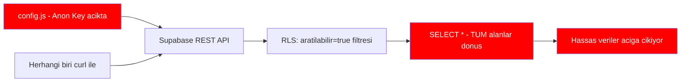

# 🔴 DevUser Güvenlik Düzeltme Planı

## Mevcut Durum - KRİTİK

Şu anda herhangi biri aşağıdaki curl komutuyla **tüm kullanıcı verilerini** çekebilir:

```bash
curl 'https://ldptefnpiudquipdsezr.supabase.co/rest/v1/devuser?select=*' \
  -H 'apikey: <anon_key>' \
  -H 'Authorization: Bearer <anon_key>'
```

### Açığa Çıkan Veriler
- Ad soyad
- WhatsApp telefon numarası
- LinkedIn profil URL'si
- Yaşadığı şehir
- İş arama durumu
- Tüm teknik bilgiler
- Kişisel tercihler

### Sorunun Kökeni



**3 temel sorun:**
1. Anon key frontend'de açık → herkes API'ye erişebilir
2. RLS sadece `aratilabilir=true` filtresi yapıyor → yeterli değil
3. `SELECT *` ile tüm alanlar dönüyor → hassas alanlar da dahil

---

## Çözüm Stratejisi

İki aşamalı yaklaşım öneriyorum:

### Aşama 1: Hemen Yapılması Gerekenler (Supabase Dashboard)

Bu değişiklikler **Supabase Dashboard SQL Editor**'den yapılmalı.

#### 1.1 Hassas Alanları Gizleyen View Oluştur

Doğrudan `devuser` tablosuna erişim yerine, sadece gösterilmesi gereken alanları içeren bir **database view** oluştur:

```sql
-- Güvenli public view oluştur
CREATE OR REPLACE VIEW devuser_public AS
SELECT 
  id,
  ad_soyad,
  sehir,
  rol,
  deneyim_seviye,
  guclu_alanlar,
  programlama_dilleri,
  framework_platformlar,
  devops_cloud,
  ilgi_konular,
  is_arama_durumu,
  freelance_aciklik,
  profesyonel_destek_verebilir,
  -- LinkedIn sadece varsa göster
  CASE WHEN linkedin_url IS NOT NULL AND linkedin_url != '' 
       THEN linkedin_url ELSE NULL END as linkedin_url,
  -- WhatsApp SADECE izin verdiyse göster
  CASE WHEN iletisim_izni = true AND whatsapp_tel IS NOT NULL 
       THEN whatsapp_tel ELSE NULL END as whatsapp_tel,
  created_at
FROM devuser
WHERE aratilabilir = true;
```

#### 1.2 RLS Politikalarını Sıkılaştır

```sql
-- Mevcut politikaları kaldır
DROP POLICY IF EXISTS "Public read" ON devuser;
DROP POLICY IF EXISTS "Public insert" ON devuser;
DROP POLICY IF EXISTS "Public update" ON devuser;

-- Yeni sıkı politikalar

-- READ: Sadece view üzerinden erişim, doğrudan tablo erişimi yok
CREATE POLICY "No direct read" ON devuser
  FOR SELECT
  TO anon
  USING (false);  -- Anon kullanıcılar doğrudan tabloyu okuyamaz

-- INSERT: Sadece yeni kayıt ekleyebilir
CREATE POLICY "Allow insert only" ON devuser
  FOR INSERT
  TO anon
  WITH CHECK (true);

-- UPDATE: Tamamen kapat (auth olmadan güncelleme yok)
CREATE POLICY "No update without auth" ON devuser
  FOR UPDATE
  TO anon
  USING (false);

-- DELETE: Tamamen kapat
CREATE POLICY "No delete" ON devuser
  FOR DELETE
  TO anon
  USING (false);
```

#### 1.3 View İçin RLS

```sql
-- View için ayrı güvenlik (Supabase view'lar için)
-- View zaten filtrelenmiş veri döndürüyor
-- Ama ek olarak view'a da RLS benzeri koruma ekle

ALTER VIEW devuser_public OWNER TO authenticated;

-- Veya daha iyi: Supabase Edge Function kullan
```

### Aşama 2: Edge Function ile API Proxy

Anon key'in doğrudan kullanılması yerine, bir **Supabase Edge Function** oluşturarak API erişimini kontrol altına al.

#### 2.1 Edge Function: get-users

```typescript
// supabase/functions/get-users/index.ts
import { serve } from 'https://deno.land/std@0.168.0/http/server.ts'
import { createClient } from 'https://esm.sh/@supabase/supabase-js@2'

const corsHeaders = {
  'Access-Control-Allow-Origin': 'https://almanya101.de',  // Sadece kendi domain
  'Access-Control-Allow-Headers': 'authorization, x-client-info, apikey, content-type',
}

serve(async (req) => {
  // CORS preflight
  if (req.method === 'OPTIONS') {
    return new Response('ok', { headers: corsHeaders })
  }

  // Rate limiting (basit)
  // Gerçek uygulamada Redis veya Supabase rate limiter kullan

  // Origin kontrolü
  const origin = req.headers.get('origin')
  if (origin !== 'https://almanya101.de') {
    return new Response(JSON.stringify({ error: 'Unauthorized' }), {
      status: 403,
      headers: { ...corsHeaders, 'Content-Type': 'application/json' }
    })
  }

  // Service role key ile bağlan (bu key SADECE Edge Function içinde)
  const supabase = createClient(
    Deno.env.get('SUPABASE_URL') ?? '',
    Deno.env.get('SUPABASE_SERVICE_ROLE_KEY') ?? ''
  )

  // Filtreleri al
  const url = new URL(req.url)
  const sehir = url.searchParams.get('sehir')
  const rol = url.searchParams.get('rol')
  const deneyim = url.searchParams.get('deneyim')

  // Sadece güvenli alanları seç
  let query = supabase
    .from('devuser')
    .select(`
      id, ad_soyad, sehir, rol, deneyim_seviye,
      guclu_alanlar, programlama_dilleri, framework_platformlar,
      devops_cloud, ilgi_konular, is_arama_durumu,
      freelance_aciklik, profesyonel_destek_verebilir,
      linkedin_url, whatsapp_tel, iletisim_izni, created_at
    `)
    .eq('aratilabilir', true)
    .order('created_at', { ascending: false })
    .limit(50)  // Pagination

  // Filtreleri uygula
  if (sehir) query = query.ilike('sehir', `%${sehir}%`)
  if (rol) query = query.eq('rol', rol)
  if (deneyim) query = query.eq('deneyim_seviye', deneyim)

  const { data, error } = await query

  if (error) {
    return new Response(JSON.stringify({ error: 'Server error' }), {
      status: 500,
      headers: { ...corsHeaders, 'Content-Type': 'application/json' }
    })
  }

  // WhatsApp numarasını sadece izin verenlerde göster
  const safeData = (data || []).map(user => ({
    ...user,
    whatsapp_tel: user.iletisim_izni ? user.whatsapp_tel : null,
    iletisim_izni: undefined  // Bu alanı client'a gönderme
  }))

  return new Response(JSON.stringify(safeData), {
    headers: { ...corsHeaders, 'Content-Type': 'application/json' }
  })
})
```

#### 2.2 Edge Function: register-user

```typescript
// supabase/functions/register-user/index.ts
import { serve } from 'https://deno.land/std@0.168.0/http/server.ts'
import { createClient } from 'https://esm.sh/@supabase/supabase-js@2'

const corsHeaders = {
  'Access-Control-Allow-Origin': 'https://almanya101.de',
  'Access-Control-Allow-Headers': 'authorization, x-client-info, apikey, content-type',
}

serve(async (req) => {
  if (req.method === 'OPTIONS') {
    return new Response('ok', { headers: corsHeaders })
  }

  if (req.method !== 'POST') {
    return new Response('Method not allowed', { status: 405, headers: corsHeaders })
  }

  // Origin kontrolü
  const origin = req.headers.get('origin')
  if (origin !== 'https://almanya101.de') {
    return new Response(JSON.stringify({ error: 'Unauthorized' }), {
      status: 403,
      headers: { ...corsHeaders, 'Content-Type': 'application/json' }
    })
  }

  const body = await req.json()

  // Input validation
  if (!body.ad_soyad || body.ad_soyad.trim().length < 2) {
    return new Response(JSON.stringify({ error: 'Ad soyad gerekli' }), {
      status: 400,
      headers: { ...corsHeaders, 'Content-Type': 'application/json' }
    })
  }

  // Sanitize inputs
  const sanitize = (str) => str ? str.trim().substring(0, 500) : null

  const supabase = createClient(
    Deno.env.get('SUPABASE_URL') ?? '',
    Deno.env.get('SUPABASE_SERVICE_ROLE_KEY') ?? ''
  )

  // Duplicate kontrolü (ad_soyad + linkedin veya whatsapp)
  if (body.linkedin_url) {
    const { data: existing } = await supabase
      .from('devuser')
      .select('id')
      .eq('linkedin_url', body.linkedin_url)
      .single()
    
    if (existing) {
      return new Response(JSON.stringify({ error: 'Bu LinkedIn profili zaten kayıtlı' }), {
        status: 409,
        headers: { ...corsHeaders, 'Content-Type': 'application/json' }
      })
    }
  }

  // Insert
  const { data, error } = await supabase
    .from('devuser')
    .insert([{
      ad_soyad: sanitize(body.ad_soyad),
      linkedin_url: sanitize(body.linkedin_url),
      whatsapp_tel: sanitize(body.whatsapp_tel),
      yasam_yeri: sanitize(body.yasam_yeri),
      sehir: sanitize(body.sehir),
      rol: sanitize(body.rol),
      deneyim_seviye: sanitize(body.deneyim_seviye),
      aktif_kod: body.aktif_kod === true || body.aktif_kod === 'true',
      guclu_alanlar: body.guclu_alanlar || [],
      acik_kaynak: body.acik_kaynak === true || body.acik_kaynak === 'true',
      kendi_proje: body.kendi_proje === true || body.kendi_proje === 'true',
      proje_link: sanitize(body.proje_link),
      programlama_dilleri: body.programlama_dilleri || [],
      framework_platformlar: body.framework_platformlar || [],
      devops_cloud: body.devops_cloud || [],
      ilgi_konular: body.ilgi_konular || [],
      ogrenmek_istenen: body.ogrenmek_istenen || [],
      is_arama_durumu: sanitize(body.is_arama_durumu),
      ai_app_builders: body.ai_app_builders || [],
      freelance_aciklik: sanitize(body.freelance_aciklik),
      gonullu_proje: body.gonullu_proje === true || body.gonullu_proje === 'true',
      katilma_amaci: sanitize(body.katilma_amaci),
      isbirligi_turu: body.isbirligi_turu || [],
      profesyonel_destek_verebilir: body.profesyonel_destek_verebilir === true || body.profesyonel_destek_verebilir === 'true',
      profesyonel_destek_almak: body.profesyonel_destek_almak === true || body.profesyonel_destek_almak === 'true',
      aratilabilir: body.aratilabilir === true || body.aratilabilir === 'true',
      iletisim_izni: body.iletisim_izni === true || body.iletisim_izni === 'true',
      kullanilan_ide: body.kullanilan_ide || [],
      kullanilan_agent: body.kullanilan_agent || [],
      ek_notlar: sanitize(body.ek_notlar),
      veri_paylasim_onay: body.veri_paylasim_onay === true || body.veri_paylasim_onay === 'true',
    }])

  if (error) {
    return new Response(JSON.stringify({ error: 'Kayıt hatası' }), {
      status: 500,
      headers: { ...corsHeaders, 'Content-Type': 'application/json' }
    })
  }

  return new Response(JSON.stringify({ success: true }), {
    headers: { ...corsHeaders, 'Content-Type': 'application/json' }
  })
})
```

---

## Uygulama Adımları

### Adım 1: Supabase Dashboard'da RLS Sıkılaştır (ACİL)

Supabase Dashboard > SQL Editor'de çalıştır:

```sql
-- 1. Mevcut politikaları kaldır
DROP POLICY IF EXISTS "Public read" ON devuser;
DROP POLICY IF EXISTS "Public insert" ON devuser;  
DROP POLICY IF EXISTS "Public update" ON devuser;
DROP POLICY IF EXISTS "Enable read access for all users" ON devuser;
DROP POLICY IF EXISTS "Enable insert for all users" ON devuser;
DROP POLICY IF EXISTS "Enable update for all users" ON devuser;

-- 2. Doğrudan tablo okumayı kapat
CREATE POLICY "block_direct_read" ON devuser
  FOR SELECT TO anon
  USING (false);

-- 3. Doğrudan insert'ü kapat (Edge Function kullanacağız)
CREATE POLICY "block_direct_insert" ON devuser
  FOR INSERT TO anon
  WITH CHECK (false);

-- 4. Update'i kapat
CREATE POLICY "block_update" ON devuser
  FOR UPDATE TO anon
  USING (false);

-- 5. Delete'i kapat
CREATE POLICY "block_delete" ON devuser
  FOR DELETE TO anon
  USING (false);

-- 6. Service role her şeyi yapabilir (Edge Functions için)
-- (Service role zaten RLS'i bypass eder, ek policy gerekmez)
```

> ⚠️ **DİKKAT:** Bu SQL'i çalıştırdıktan sonra mevcut frontend ÇALIŞMAZ olacak. Önce Edge Function'ları deploy etmek veya geçici bir çözüm uygulamak gerekir.

### Adım 2: Geçici Çözüm (Edge Function hazır olana kadar)

Eğer Edge Function hemen deploy edilemiyorsa, daha az kısıtlayıcı ama yine de iyileştirilmiş bir RLS:

```sql
-- Geçici: Sadece belirli alanları okumaya izin ver
-- (Bu tam koruma sağlamaz ama SELECT * ile tüm veri çekilmesini zorlaştırır)

DROP POLICY IF EXISTS "Public read" ON devuser;

-- Okuma: Sadece aratilabilir=true olanlar, ama tüm alanlar hala görünür
-- Bu yeterli DEĞİL ama geçici olarak:
CREATE POLICY "limited_read" ON devuser
  FOR SELECT TO anon
  USING (aratilabilir = true);

-- Insert: İzin ver ama rate limit yok
CREATE POLICY "allow_insert" ON devuser
  FOR INSERT TO anon
  WITH CHECK (true);

-- Update ve Delete: Kapat
CREATE POLICY "block_update" ON devuser
  FOR UPDATE TO anon
  USING (false);

CREATE POLICY "block_delete" ON devuser
  FOR DELETE TO anon
  USING (false);
```

### Adım 3: Database View ile Alan Kısıtlama

```sql
-- Güvenli view oluştur
CREATE OR REPLACE VIEW devuser_public AS
SELECT 
  id,
  ad_soyad,
  sehir,
  rol,
  deneyim_seviye,
  guclu_alanlar,
  programlama_dilleri,
  framework_platformlar,
  devops_cloud,
  ilgi_konular,
  is_arama_durumu,
  freelance_aciklik,
  profesyonel_destek_verebilir,
  linkedin_url,
  CASE WHEN iletisim_izni = true THEN whatsapp_tel ELSE NULL END as whatsapp_tel,
  created_at
FROM devuser
WHERE aratilabilir = true;

-- View'a anon erişim ver
GRANT SELECT ON devuser_public TO anon;
```

Sonra frontend'de `.from('devuser')` yerine `.from('devuser_public')` kullan.

### Adım 4: Frontend Değişiklikleri

`list.html`'de:
```javascript
// ESKİ (güvensiz):
const { data, error } = await supabase
  .from('devuser')
  .select('*')

// YENİ (view kullan):
const { data, error } = await supabase
  .from('devuser_public')
  .select('*')
```

### Adım 5: Edge Function Deploy (Uzun Vadeli)

```bash
# Supabase CLI ile
supabase functions new get-users
supabase functions new register-user
supabase functions deploy get-users
supabase functions deploy register-user
```

---

## Öncelik Sırası

| # | Aksiyon | Etki | Karmaşıklık |
|---|---------|------|-------------|
| 1 | Database View oluştur + frontend'i view'a yönlendir | Hassas alanları gizler | Düşük |
| 2 | RLS'de UPDATE/DELETE kapat | Veri manipülasyonunu engeller | Düşük |
| 3 | Edge Function: get-users | Origin kontrolü + rate limiting | Orta |
| 4 | Edge Function: register-user | Input validation + duplicate check | Orta |
| 5 | Anon key'i frontend'den kaldır | Tam API gizliliği | Yüksek |

---

## Hemen Yapılabilecek Minimum Düzeltme

En hızlı ve en az riskli düzeltme:

1. **Supabase Dashboard > SQL Editor'de** `devuser_public` view'ını oluştur
2. **`list.html`'de** `.from('devuser')` → `.from('devuser_public')` değiştir
3. **Supabase Dashboard'da** UPDATE ve DELETE politikalarını kapat
4. **`devuser` tablosunda** doğrudan SELECT'i sadece `aratilabilir=true` ile sınırla

Bu 4 adım, curl ile yapılan saldırıda en azından:
- WhatsApp numaraları (izin vermeyenlerin) gizlenir
- Veri güncellenemez/silinemez
- Sadece aratılabilir profiller görünür

