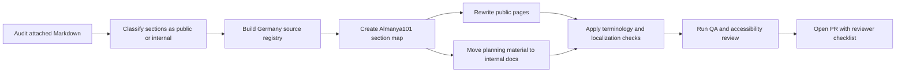
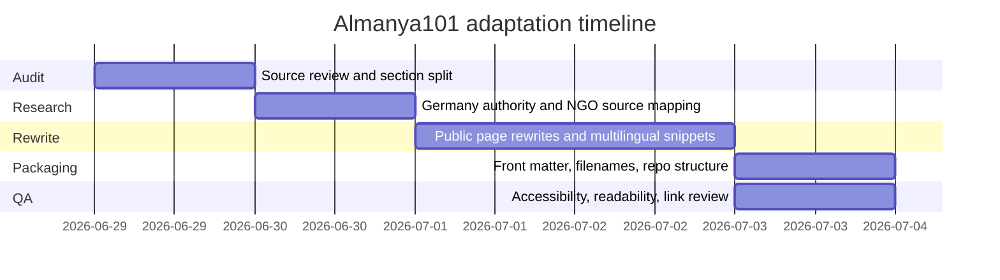

# Almanya101 Adaptation Report for the Attached Markdown

## Executive Summary

### English

The attached Markdown is not a typical end-user article. It is a product-and-implementation memo: it opens with an executive summary, then defines ten migration-related tools, and finishes with operational appendices on scoring, data sources, privacy, implementation, testing, effort, an ERD, a Gantt timeline, and a reusable research prompt. In other words, the source text is structurally strong, but it is designed for strategy and delivery planning rather than for learners or residents who need practical guidance. fileciteturn0file0

For **Almanya101**, the best adaptation is therefore **not** a literal rewrite of the whole file into one page. The stronger approach is to split the material into two layers: a **public-facing Germany guide set** for newcomers and German learners, and an **internal editorial/developer appendix** for scoring models, source registries, timelines, prompts, and QA. This is especially important because Germany-specific guidance should rely on official portals that already organize information by visas, recognition, housing and registration, salary/tax/social security, health insurance, family life, schools, and integration courses—most notably **Make it in Germany**, **BAMF**, **Anerkennung in Deutschland**, and the **Federal Employment Agency**. citeturn3view0turn21view0turn4view5turn16view0

The recommended editorial target for Almanya101 is a multilingual, plain-language knowledge base for Turkish-speaking prospective migrants, new residents, and German learners. The strongest Germany-specific anchors are: residence pathways such as the **EU Blue Card** and the **Opportunity Card**; recognition rules for regulated and non-regulated professions; **Anmeldung** after arrival; mandatory **health insurance**; salary/tax basics; family benefits and school obligations; and BAMF-funded **integration courses**. These are all already documented on official German portals and can replace the source file’s generic cross-country framing with a Germany-first workflow. citeturn4view2turn8view7turn19view0turn6view0turn6view1turn16view0turn18view0turn18view1turn7view0

### Türkçe

Ekli Markdown dosyası tipik bir son kullanıcı rehberi değildir. Daha çok bir ürün/uygulama planı niteliğindedir: başta özet vardır, ardından göç temalı on araç tanımlanır, sonra da puanlama, veri kaynakları, gizlilik, uygulama planı, testler, efor tahmini, ERD, zaman planı ve tekrar kullanılabilir araştırma komutu gibi ekler gelir. Yani kaynak metin yapısal olarak güçlüdür; ancak öğrenenler veya Almanya’da yaşamaya hazırlanan kullanıcılar için doğrudan yayınlanacak rehber formunda değildir. fileciteturn0file0

Bu nedenle **Almanya101** için en doğru yaklaşım, dosyayı tek bir uzun sayfaya çevirmek değil; içeriği iki katmana ayırmaktır: bir yanda yeni gelenler ve Almanca öğrenenler için **kullanıcı odaklı Almanya rehberleri**, diğer yanda puanlama modelleri, kaynak listeleri, zaman çizelgeleri, prompt’lar ve QA listeleri için **iç dokümantasyon**. Bu yaklaşım özellikle önemlidir; çünkü Almanya’ya özgü içerik zaten resmi portallarda vizeler, denklik, konut ve kayıt, maaş/vergi/sosyal güvenlik, sağlık sigortası, aile yaşamı, okul sistemi ve entegrasyon kursları başlıkları altında düzenli şekilde sunulmaktadır. Bu alanda temel resmi omurga **Make it in Germany**, **BAMF**, **Anerkennung in Deutschland** ve **Bundesagentur für Arbeit** olmalıdır. citeturn3view0turn21view0turn4view5turn16view0

Almanya101 için önerilen editoryal hedef; Türkçe konuşan aday göçmenler, yeni gelenler ve Almanca öğrenenler için çok dilli, sade dilli, işlem odaklı bir bilgi tabanıdır. Almanya bağlamında öne çıkan ana eksenler şunlardır: **Blaue Karte EU** ve **Chancenkarte** gibi oturum yolları; denklik gerektiren ve gerektirmeyen meslekler; varış sonrası **Anmeldung**; zorunlu **sağlık sigortası**; maaş/vergi temelleri; aile destekleri ve okul zorunluluğu; BAMF destekli **entegrasyon kursları**. Bu resmi yapı, kaynak dosyadaki genel “ülke seçimi” yaklaşımını, Almanya-odaklı bir yaşam ve yerleşim akışına dönüştürmek için güçlü bir temel sağlar. citeturn4view2turn8view7turn19view0turn6view0turn6view1turn16view0turn18view0turn18view1turn7view0

## Source File Audit

### English analysis

The source file has three clear layers.

The first layer is a **conceptual front section**: an executive summary framing the document as a proposal for ten click-through migration or diaspora tools. The second layer is the **ten-tool body**, covering country choice, salary comparison, relocation readiness, city matching, diaspora matching, overseas career pathing, lifestyle type, a first-90-days planner, top relocation challenge, and job-finding probability. The third layer is an **implementation appendix** with scoring templates, source summaries, privacy, backend/data model notes, endpoints, testing, effort estimates, ERD, timeline, and a reusable deep-research prompt. fileciteturn0file0

That structure is coherent for an internal planning memo, but it is not ideal for Almanya101 as a public guide. The central mismatch is editorial intent: the source file is about **building assessment tools**, whereas Almanya101 presumably needs **usable, Germany-specific onboarding content**. That means the adaptation should preserve the logic of the original document—decision support, audience segmentation, and actionability—while changing the content type from “tool spec” to “guide + checklist + source-backed explainer.” fileciteturn0file0

A second structural observation is that only some source sections are truly public-facing. The ten numbered tool sections are strong candidates for transformation into newcomer guides, self-checks, or decision pages. By contrast, sections such as the scoring framework, privacy notes, implementation plan, ERD, Gantt chart, and reusable prompt belong in `/docs/internal` or `/docs/editorial`, not in the public Almanya101 content tree. fileciteturn0file0

### Türkçe değerlendirme

Kaynak dosya üç katmandan oluşuyor. İlk katman kavramsal giriş kısmı; ikinci katman on araçlık ana gövde; üçüncü katman ise uygulama ve operasyon ekleri. Bu yapı iç planlama için mantıklı, fakat Almanya101 için doğrudan kullanıcıya sunulacak rehber yapısı değil. Temel uyumsuzluk, belgenin “araç tasarlama” amacıyla yazılmış olmasıdır; Almanya101’in ise “Almanya’da nasıl ilerlenir?” sorusuna cevap veren, işlem odaklı içeriklere ihtiyacı vardır. fileciteturn0file0

Bu yüzden uyarlama, orijinal mantığı korumalı; fakat içerik tipini değiştirmelidir. Yani “quiz/spec” mantığı, Almanya101’de “rehber + kontrol listesi + resmi kaynaklı açıklayıcı içerik” formatına dönüştürülmelidir. Ayrıca orijinal dosyadaki puanlama şablonları, ERD, zaman çizelgesi ve prompt gibi bölümler açık siteden çok dahili dokümantasyona taşınmalıdır. fileciteturn0file0

### Original structure and recommended split

| Original top-level section | Recommended Almanya101 handling |
|---|---|
| Executive Summary | Public intro page |
| Ten tool sections | Convert into user-facing Germany topic pages |
| Scoring framework | Internal editorial rubric |
| Data sources summary | Internal source registry |
| Privacy and consent | Public legal note + internal policy note |
| Implementation plan | Internal docs |
| Testing and KPIs | Internal QA docs |
| Effort and prioritization | Internal migration plan |
| ERD and Gantt | Internal docs |
| Reusable prompt | Internal AI drafting prompt |

## Almanya101 Adaptation Blueprint

### English analysis

I would treat the **target audience** as four overlapping groups: Turkish-speaking people considering Germany, newly arrived residents in Germany, German learners who need practical civic and administrative vocabulary, and families navigating schools, benefits, and registration. That audience assumption is consistent with Germany’s official multilingual newcomer ecosystem: BAMF makes integration-course information available in Turkish and other languages; MBE counselling is multilingual, free, and confidential; and Handbook Germany presents free, multilingual, anonymous practical guidance plus local support search. citeturn21view0turn15view0turn14view0

From that audience definition, Almanya101 should require the following content features on almost every page: a clear “Who is this for?” box; a distinction between **EU**, **non-EU**, and already-resident situations; a short glossary of German administrative terms; a “What to do before arrival / after arrival / after registration” sequence; a visible “Last reviewed” date; and an “Official source first” resource block. This is not theoretical: Germany’s official portals already break newcomer information down into recognition, visa and residence, housing and registration, salary/tax/social security, bank account, health insurance, integration courses, family support, and school system information. citeturn3view0turn16view0turn6view0turn18view3turn6view1turn7view0turn18view0turn18view1

The **most important editorial change** is to replace generic “Which country fits you?” thinking with “Which Germany pathway fits your situation?” For example, the source section on country choice should become a Germany route-selection page comparing study, vocational training, employment, EU Blue Card, recognition-linked residence, and the Opportunity Card. The same logic applies throughout: a global salary comparison becomes a Germany salary-and-net-pay explainer; a city match becomes “Which German city or federal state fits you?”; and diaspora matching becomes “Find counselling, community, and practical support in Germany.” Official German pathways are concrete enough to support this replacement. The EU Blue Card page specifies job-offer and salary-threshold conditions; the Skilled Immigration Act page explains the Opportunity Card and recognition-related residence rules; and the recognition pages distinguish regulated from non-regulated professions. citeturn4view2turn8view7turn19view0turn8view6

### Türkçe özet

Hedef kitleyi dört kesişen grup olarak düşünmek en doğru yaklaşım olur: Almanya’yı düşünen Türkçe konuşan kullanıcılar, Almanya’ya yeni gelenler, günlük ve idari Almanca öğrenmek isteyenler ve okul/aile/yardım süreçlerini yönetmeye çalışan aileler. Bu varsayım, Almanya’daki çok dilli resmi ekosistemle uyumludur: BAMF içerikleri Türkçe sunar; MBE ücretsiz, gizli ve çok dillidir; Handbook Germany ücretsiz, çok dilli ve anonim bir pratik bilgi platformudur. citeturn21view0turn15view0turn14view0

Bu kitle için Almanya101 sayfalarının çoğunda şu unsurlar standart olmalıdır: “Bu sayfa kim için?”, “AB vatandaşı / AB dışı / Almanya’da zaten bulunan kişi” ayrımı, küçük sözlük, “gelmeden önce / geldikten sonra / kayıt sonrası” akışı, görünür inceleme tarihi ve “önce resmi kaynak” kutusu. Ayrıca genel “hangi ülke?” yaklaşımı Almanya101’de “senin için Almanya’daki hangi yol uygun?” yaklaşımına dönüştürülmelidir. Örneğin ülke seçimi bölümü, Almanya’da öğrenci, Ausbildung, çalışma, Blaue Karte EU, tanıma süreci ve Chancenkarte seçeneklerini kıyaslayan bir rehbere çevrilmelidir. citeturn3view0turn4view2turn8view7turn19view0

### Section comparison and rewrite snippets

The tables below cover **all top-level source sections** and map each one to an Almanya101 equivalent. The snippets are intentionally short and GitHub-friendly.

#### Public-facing conversions

| Original section | Almanya101 equivalent | Turkish snippet | German snippet | English translation | Handling |
|---|---|---|---|---|---|
| Executive Summary | Start here: Your path to Germany | “Almanya’ya gelmeden önce hangi adımları atman gerektiğini kısa ve net şekilde burada öğren.” | „Hier erfährst du kurz und klar, welche Schritte vor deinem Umzug nach Deutschland wichtig sind.“ | “Learn here, briefly and clearly, which steps matter before moving to Germany.” | Public intro |
| Which Country Suits You? | Which Germany pathway fits you? | “Senin için en uygun yol çalışma, Ausbildung, üniversite ya da Chancenkarte olabilir.” | „Für dich kann Arbeit, Ausbildung, Studium oder die Chancenkarte der passende Weg sein.“ | “For you, work, vocational training, university, or the Opportunity Card may be the right path.” | Rewrite heavily |
| Profession Paycheck Worldwide | Salary expectations in Germany | “Mesleğine göre Almanya’da brüt, net ve yaşam maliyeti dengesini karşılaştır.” | „Vergleiche für deinen Beruf in Deutschland Brutto, Netto und Lebenshaltungskosten.“ | “Compare gross pay, net pay, and living costs in Germany for your profession.” | Rewrite heavily |
| Relocation Readiness | Are you ready for Germany? | “Belgelerin, dil seviyen ve bütçen Almanya sürecine hazır mı?” | „Sind deine Unterlagen, deine Sprachkenntnisse und dein Budget bereit für Deutschland?“ | “Are your documents, language level, and budget ready for Germany?” | Rewrite heavily |
| Best City for You | Which German city or state fits you? | “Berlin, NRW, Bayern ya da başka bir eyalet: senin yaşam tarzına hangisi daha uygun?” | „Berlin, NRW, Bayern oder ein anderes Bundesland: Was passt besser zu deinem Alltag?“ | “Berlin, NRW, Bavaria, or another state: which fits your daily life better?” | Rewrite heavily |
| Diaspora Network Matchmaker | Community and counselling in Germany | “Yalnız değilsin: danışmanlık, topluluk ve yerel destek noktalarını bul.” | „Du bist nicht allein: Finde Beratung, Community und lokale Unterstützung.“ | “You are not alone: find counselling, community, and local support.” | Public service page |
| Overseas Career Path | Career and training routes in Germany | “Almanya’da iş, Ausbildung, yüksek lisans veya denklik sürecinden hangisi sana daha uygun?” | „Was passt in Deutschland besser zu dir: Job, Ausbildung, Masterstudium oder Anerkennung?“ | “Which suits you better in Germany: a job, vocational training, a master’s degree, or recognition?” | Rewrite heavily |
| Expat Lifestyle Type | Everyday life in Germany | “Büyük şehir mi, sakin şehir mi, aile dostu çevre mi? Almanya’da nasıl bir yaşam istiyorsun?” | „Großstadt, ruhige Stadt oder familienfreundliches Umfeld: Welches Leben in Deutschland suchst du?“ | “Big city, quiet town, or family-friendly environment: what kind of life in Germany do you want?” | Tone change |
| First 90 Days Planner | First 90 days in Germany | “İlk 90 günde Anmeldung, sigorta, banka hesabı ve oturum işlemlerini sıraya koy.” | „Ordne in den ersten 90 Tagen Anmeldung, Versicherung, Bankkonto und Aufenthaltstitel.“ | “In your first 90 days, put registration, insurance, bank account, and residence steps in order.” | Excellent fit |
| Top Relocation Challenge | What should you solve first? | “Önce vize mi, denklik mi, konut mu, yoksa dil mi? Önceliğini belirle.” | „Zuerst Visum, Anerkennung, Wohnung oder Sprache? Setze deine Priorität.“ | “Visa, recognition, housing, or language first? Set your priority.” | Excellent fit |
| Job-Finding Probability | How strong are your job prospects in Germany? | “Mesleğin, deneyimin ve dil durumun Almanya’daki iş şansını nasıl etkiliyor?” | „Wie beeinflussen Beruf, Erfahrung und Sprache deine Jobchancen in Deutschland?“ | “How do your profession, experience, and language affect your job prospects in Germany?” | Rewrite with German labor focus |

#### Internal or hybrid conversions

| Original section | Almanya101 equivalent | Turkish snippet | German snippet | English translation | Handling |
|---|---|---|---|---|---|
| Consolidated Scoring Framework Template | Editorial scoring rubric | “Bu bölüm kullanıcıya değil, editöryal karar ağacına hizmet etmeli.” | „Dieser Teil sollte nicht öffentlich, sondern als redaktionelle Bewertungslogik genutzt werden.“ | “This section should serve editorial decision logic, not public content.” | Internal only |
| Data Sources Summary | Germany source registry | “Resmi kaynak önceliği: BAMF, Make it in Germany, BA, Anerkennung in Deutschland.” | „Quellenpriorität: BAMF, Make it in Germany, BA, Anerkennung in Deutschland.“ | “Source priority: BAMF, Make it in Germany, BA, Recognition in Germany.” | Internal only |
| Privacy and Consent | Public disclaimer + internal policy note | “Bilgilendirme amaçlıdır; hukuki tavsiye değildir; durum eyalete ve statüye göre değişebilir.” | „Nur zur Information; keine Rechtsberatung; Regeln können je nach Bundesland und Status abweichen.“ | “For information only; not legal advice; rules may vary by state and status.” | Hybrid |
| Implementation Plan | Repo publishing workflow | “Yayın akışı, dosya yapısı ve repository kuralları burada dokümante edilmeli.” | „Publikationsablauf, Dateistruktur und Repository-Regeln gehören hierhin.“ | “Publishing flow, file structure, and repository rules belong here.” | Internal only |
| Testing and KPIs | QA and content review checklist | “Kullanıcı testi yerine burada bağlantı, okunabilirlik ve kaynak kontrolü öne çıkar.” | „Statt Produkt-KPIs stehen hier Linkprüfung, Lesbarkeit und Quellenkontrolle im Vordergrund.“ | “Instead of product KPIs, this should focus on link checks, readability, and source control.” | Internal only |
| Estimated Effort and Prioritization | Editorial migration backlog | “Hangi sayfa önce yayınlanacak, hangi sayfa bekleyecek burada belirlenmeli.” | „Hier wird festgelegt, welche Seiten zuerst veröffentlicht werden.“ | “This is where publication priority should be defined.” | Internal only |
| Entity-Relationship Diagram | Front matter/content model diagram | “ERD yerine içerik şeması ve front matter modeli daha uygun.” | „Statt eines ERD ist ein Content-Schema mit Front Matter sinnvoller.“ | “A content schema and front matter model are more suitable than an ERD.” | Internal only |
| MVP Timeline and Reusable Prompt | Rollout timeline and AI drafting prompt | “Zaman planı ve AI prompt’u, açık sayfada değil dahili belgede tutulmalı.” | „Zeitplan und KI-Prompt gehören in interne Dokumentation, nicht auf die öffentliche Seite.“ | “Timeline and AI prompt belong in internal documentation, not public pages.” | Internal only |

## Germany Localization Standards

### English analysis

The Germany localization pass should be grounded in an official-source stack.

For **visa and residence**, use **Make it in Germany** as the first public-facing explainer, because it is the German government’s official site for qualified professionals and organizes content by visa types, residence, recognition, housing, family life, and services. Its EU Blue Card page already specifies salary thresholds, job-offer requirements, residence-title logic, and the step sequence after arrival. Its Skilled Immigration Act page explains the Opportunity Card, including the June 2024 introduction, minimum points, language thresholds, self-support requirement, and the possibility of up to 20 hours of work per week. citeturn3view0turn4view2turn8view7

For **recognition**, the best pair is **Make it in Germany** plus **Anerkennung in Deutschland**. Official guidance distinguishes regulated professions from non-regulated professions, explains that some professions require recognition and often a licence to practise, and points users to the Recognition Finder and counselling search. It also clarifies that for some academic cases a positive **anabin** result or a **Statement of Comparability** is sufficient proof. citeturn19view0turn4view5

For **arrival logistics**, localize generic “settling abroad” language into Germany’s real administrative sequence: find temporary accommodation, complete **Anmeldung**, open a bank account, secure health insurance, review your work contract, and manage salary/tax/social-security expectations. Make it in Germany notes that residence should generally be registered within two weeks of arrival, that a German bank account is typically needed for rent and salary transfer, that health insurance is compulsory, and that written employment contracts are standard and should spell out salary and leave conditions. citeturn6view0turn18view3turn6view1turn18view2turn16view0

For **family and learning**, Germany localization should use official family-support and school references and newcomer language pathways. Official pages explain parental leave and parental allowance support, compulsory schooling from age six, federal-state variation in school systems, and BAMF-funded integration courses that combine language and orientation content. Those integration courses explicitly cover everyday administration, work, communication with offices, and German society; they typically include 600 language lessons and 100 orientation lessons, and successful participants receive a certificate. citeturn18view0turn18view1turn7view0turn8view3

For **support beyond government pages**, use trusted Germany-based newcomer support platforms rather than generic expat blogs. MBE offers free, confidential, multilingual counselling, including Turkish, and directs users to BAMF-NAvI local counselling. Handbook Germany offers free, multilingual, anonymous guidance plus local-search support. These are strong secondary links for Almanya101 because they are practical, newcomer-oriented, and multilingual without replacing official legal sources. citeturn15view0turn14view0turn21view0

### Türkçe özet

Almanya uyarlamasında kaynak hiyerarşisi çok net kurulmalı. Vize ve oturum tarafında ilk omurga **Make it in Germany** olmalı; çünkü bu portal, Almanya hükümetinin nitelikli çalışanlar için resmi sitesidir ve vize türlerini, denklik süreçlerini, konut-kayıt, aile yaşamı ve hizmetler başlıklarını düzenli biçimde sunar. **Blaue Karte EU** ve **Chancenkarte** gibi güncel oturum yolları da burada açıkça anlatılır. citeturn3view0turn4view2turn8view7

Denklik tarafında **Make it in Germany** ile **Anerkennung in Deutschland** birlikte kullanılmalı. Resmi içerik, düzenlenmiş ve düzenlenmemiş meslekler ayrımını yapar; hangi durumlarda tanıma veya meslek icra izni gerektiğini açıklar; ayrıca **Recognition Finder** ve danışmanlık aramasına yönlendirir. Bazı akademik durumlarda **anabin** çıktısı veya **Statement of Comparability** yeterli kanıt olabilir. citeturn19view0turn4view5

Yerleşim adımlarında genel “yurtdışına taşınma” dili bırakılmalı; onun yerine Almanya’daki gerçek sıralama kullanılmalıdır: geçici konut, **Anmeldung**, banka hesabı, sağlık sigortası, iş sözleşmesi kontrolü, maaş/vergi/sosyal güvenlik mantığı. Ayrıca aile ve öğrenme bölümlerinde ebeveyn izni, okul zorunluluğu ve BAMF entegrasyon kursları gibi resmi içerikler temel alınmalıdır. citeturn6view0turn18view3turn6view1turn18view2turn16view0turn18view0turn18view1turn7view0

### Terminology changes and localization notes

| Replace or de-emphasize | Use in Almanya101 | Localization note |
|---|---|---|
| “Moving abroad” | “Moving to Germany” / “Arriving in Germany” | Remove generic destination language |
| “Best country” | “Best pathway in Germany” | Country-comparison logic is too broad |
| “Visa” | “Visum” / “Aufenthaltstitel” | Distinguish entry visa from residence title |
| “Permanent residence” | “Niederlassungserlaubnis” / settlement permit | Use German legal term and English gloss |
| “Citizenship” | “Einbürgerung” / naturalisation | Prefer current Germany-specific term |
| “Foreigners office” | “Ausländerbehörde” | Add plain-language explanation |
| “Registration” | “Anmeldung” at the Bürgeramt/Meldebehörde | Central arrival concept in Germany |
| “Recognition” | “Anerkennung” / “Zeugnisbewertung” / “Statement of Comparability” | Distinguish professional vs academic cases |
| “Job seeker visa” | “Chancenkarte” / Opportunity Card | Reflect current 2024+ terminology |
| “Work permit” | Employment authorization under residence status | Avoid oversimplified phrasing |
| “Public insurance” | “Gesetzliche Krankenversicherung” | Name both statutory and private systems |
| “Salary” | “Brutto” and “Netto” | Germany users expect this distinction |
| “Family allowance” | “Kindergeld”, “Elterngeld”, “Elternzeit” | Use specific Germany benefits |
| “State” | “Bundesland” | Important for schools and administration |
| “Support center” | “MBE”, BAMF-NAvI, local counselling | Use real program names |

### Suggested Germany source stack for Almanya101

- **Core official portal:** Make it in Germany, for visas, recognition, work environment, housing and registration, bank account, health insurance, family life, schools, and services. citeturn3view0turn6view0turn18view3turn6view1turn18view0turn18view1
- **Migration and language integration:** BAMF, especially integration courses and local course search via BAMF-NAvI. BAMF’s English page explicitly offers Turkish and other language versions. citeturn21view0
- **Recognition and counselling:** Anerkennung in Deutschland, especially the Recognition Finder, counselling search, and simple-language access. citeturn4view5
- **Salary benchmarking:** Federal Employment Agency via the Entgeltatlas referenced by Make it in Germany. citeturn16view0
- **Community and practical support:** MBE and Handbook Germany for multilingual, newcomer-oriented follow-up support. citeturn15view0turn14view0

## GitHub-ready Repository Package

### English analysis

The source file should become a **small content package**, not a monolithic upload. I recommend a locale-based structure with a clean separation between public content and internal documentation.

```text
content/
  en/
    almanya101/
      start-here.md
      pathways/
        germany-pathway-check.md
        opportunity-card.md
        eu-blue-card.md
      work/
        recognition-of-foreign-qualifications.md
        salary-taxes-social-security.md
        work-contract-basics.md
      living/
        housing-and-registration.md
        bank-account.md
        health-insurance.md
      family/
        parental-leave-and-benefits.md
        school-system-and-compulsory-education.md
      support/
        counselling-and-community-in-germany.md
        first-90-days.md
  tr/
    almanya101/
      ...
  de/
    almanya101/
      ...
docs/
  internal/
    almanya101-source-registry.md
    almanya101-editorial-rubric.md
    almanya101-migration-plan.md
    almanya101-qa-checklist.md
    almanya101-ai-drafting-prompt.md
```

This split matches the real subject matter. Public pages can guide newcomers through recognition, housing, insurance, integration courses, school obligations, and naturalisation benchmarks. Internal docs can preserve the original source file’s planning DNA: scoring logic, timelines, source registries, and prompts. That separation is justified by the original document’s mix of public-looking concepts and internal delivery detail. fileciteturn0file0

### Türkçe özet

Bu dosya GitHub’a tek parçalı bir metin olarak değil, **küçük bir içerik paketi** olarak taşınmalı. En temiz yöntem; `en`, `tr`, `de` klasörleri altında kullanıcıya dönük sayfaları tutmak ve `docs/internal` içinde kaynak listesi, editoryal şablon, QA ve AI prompt gibi dahili belgeleri saklamaktır. Böylece Almanya101’in açık içerik katmanı ile operasyonel dokümantasyonu birbirine karışmaz. fileciteturn0file0

### Recommended front matter

```yaml
---
title: "Recognition of Foreign Qualifications in Germany"
title_tr: "Almanya’da Yabancı Diplomaların ve Mesleki Yeterliliklerin Tanınması"
title_de: "Anerkennung ausländischer Qualifikationen in Deutschland"
slug: "recognition-of-foreign-qualifications"
project: "Almanya101"
locale: "en"
translation_key: "recognition-foreign-qualifications"
summary: "How recognition works in Germany, who needs it, and where to start."
audience:
  - prospective_residents
  - new_arrivals
  - german_learners
content_type: "guide"
source_priority:
  - official_german_government
  - official_state_portals
  - trusted_ngos
  - reputable_media
topics:
  - recognition
  - work
  - residence
  - germany
last_reviewed: "2026-06-26"
review_cycle_days: 90
cefr_target:
  de: "A2-B1"
  tr: "plain-language"
  en: "plain-language"
state_specific_note: true
legal_notice: "Information only; regulations may vary by residence status and federal state."
canonical_locale: "en"
related_pages:
  - "opportunity-card"
  - "eu-blue-card"
  - "first-90-days"
---
```

### Filename suggestions

- `content/en/almanya101/start-here.md`
- `content/en/almanya101/pathways/germany-pathway-check.md`
- `content/en/almanya101/work/recognition-of-foreign-qualifications.md`
- `content/en/almanya101/living/housing-and-registration.md`
- `content/en/almanya101/living/health-insurance.md`
- `content/en/almanya101/support/first-90-days.md`
- `docs/internal/almanya101-source-registry.md`
- `docs/internal/almanya101-qa-checklist.md`

### Commit message suggestions

- `feat(almanya101): split source md into public guides and internal docs`
- `feat(almanya101): add Germany-specific pathway pages for Blue Card and Opportunity Card`
- `feat(almanya101): localize recognition content with official German sources`
- `feat(almanya101): add housing, registration, bank account, and insurance guides`
- `docs(almanya101): add source registry and editorial rubric`
- `docs(almanya101): add multilingual front matter schema`
- `chore(almanya101): normalize filenames and translation keys`
- `test(almanya101): add QA checklist for links, readability, and accessibility`

### Suggested PR description

```md
## Summary
This PR adapts the original planning-style Markdown into an Almanya101-ready content package.

## What changed
- Split the original monolithic document into public guides and internal docs
- Reframed global migration topics into Germany-specific pathways
- Replaced generic references with official German sources
- Added multilingual front matter and locale-ready filenames
- Added QA, accessibility, and readability checks

## Public pages added
- Start Here
- Germany Pathway Check
- Recognition of Foreign Qualifications
- Housing and Registration
- Health Insurance
- First 90 Days in Germany

## Internal docs added
- Source registry
- Editorial rubric
- Migration plan
- QA checklist
- AI drafting prompt

## Source strategy
Official German government sources first, then trusted NGO/community support pages.

## Reviewer focus
- Accuracy of Germany-specific terminology
- Source quality and freshness
- Clarity for Turkish-speaking newcomers and German learners
- Correct separation of public vs internal materials
```

### Reviewer checklist

```md
- [ ] Public pages no longer read like product specs
- [ ] Germany-specific terminology is correct and glossed
- [ ] EU / non-EU differences are clearly stated where needed
- [ ] All legal or administrative claims point to official sources
- [ ] State-specific variation is flagged where relevant
- [ ] German snippets stay within target readability level
- [ ] Front matter is consistent across locales
- [ ] Internal-only material is not exposed in public pages
- [ ] Links resolve and are still current
- [ ] Last reviewed date is present
```

## Migration Plan, Quality Gates, and Representative Sample

### English analysis

A realistic migration plan for this one-file adaptation is **about five business days** for one content editor plus one reviewer, or **two to three days** if research and rewriting run in parallel. The effort is not driven by Markdown mechanics; it is driven by research hygiene, terminology choices, public/internal splitting, and multilingual rewriting. The source file is substantial enough that a literal rewrite would create a confusing public page. Splitting and relabeling are therefore part of the core task, not optional polish. fileciteturn0file0

A strong step-by-step plan would look like this:

| Phase | Deliverable | Estimated effort |
|---|---|---|
| Audit | Section map, public/internal split | 0.5 day |
| Research | Germany source registry and terminology map | 1 day |
| Rewrite | Public Almanya101 pages in EN/TR/DE snippet mode | 1.5 days |
| Package | Front matter, filenames, repo structure, internal docs | 0.5 day |
| QA | Link check, readability, accessibility, editorial review | 0.5 day |
| Review and merge | PR revision and final merge prep | 0.5 day |

### Türkçe özet

Bu uyarlama için gerçekçi süre, tek bir içerik editörü ve bir reviewer ile **yaklaşık beş iş günü**dür. Araştırma ve yazım paralel yürütülürse **iki ila üç güne** de inebilir. Buradaki asıl iş Markdown düzenlemek değil; kaynakları Almanya bağlamına göre doğrulamak, terminolojiyi düzeltmek, kamuya açık ve dahili içerikleri ayırmak ve çok dilli metinleri tutarlı hale getirmektir. fileciteturn0file0

### Workflow diagram



### Rollout timeline



### QA checklist and accessibility/readability checks

WCAG 2.2 should be the baseline for any rendered Almanya101 site or docs experience. W3C recommends WCAG 2.2 for current accessibility work and notes that it improves access for a wide range of disabilities while also improving usability more generally. citeturn11view0

For Almanya101 specifically, I recommend the following acceptance checks:

- Every public page must distinguish **EU citizen**, **non-EU skilled worker**, and **already resident in Germany** cases where the answer changes.
- Every page must have a **last reviewed date**, a **legal-information-only note**, and an **official-source block**.
- German-language explanatory text aimed at learners should target **A2-B1** where possible; when legal precision forces harder language, key terms should be glossed in Turkish and English. This recommendation fits Germany’s official language benchmarks: B1 is used as an important threshold for naturalisation proof, while the Opportunity Card route can require A1 German or B2 English depending on the case. citeturn8view5turn8view7
- Use short paragraphs, descriptive links, logical heading hierarchy, table headers, and plain error-free wording.
- If rendered on the web, no information should depend only on color, focus order must remain logical, and keyboard access must be preserved in line with WCAG’s perceivable, operable, and understandable principles. citeturn11view0
- Bias toward multilingual discoverability: BAMF, MBE, and Handbook Germany all demonstrate practical value in offering Turkish and other language access. citeturn21view0turn15view0turn14view0

### Sample adapted Markdown file

The sample below uses one of the strongest Germany-specific topics: **recognition of foreign qualifications**. The content is aligned to official recognition guidance, regulated profession rules, recognition-search tools, and multilingual counselling support. citeturn19view0turn4view5turn15view0

```md
---
title: "Recognition of Foreign Qualifications in Germany"
title_tr: "Almanya’da Yabancı Diplomaların ve Mesleki Yeterliliklerin Tanınması"
title_de: "Anerkennung ausländischer Qualifikationen in Deutschland"
slug: "recognition-of-foreign-qualifications"
project: "Almanya101"
locale: "en"
translation_key: "recognition-foreign-qualifications"
summary: "Find out whether you need recognition in Germany, where to check your profession, and what to do next."
audience:
  - prospective_residents
  - new_arrivals
  - german_learners
content_type: "guide"
topics:
  - recognition
  - work
  - residence
  - germany
last_reviewed: "2026-06-26"
review_cycle_days: 90
state_specific_note: true
legal_notice: "Information only. Rules may vary depending on your profession, residence status, and federal state."
related_pages:
  - "opportunity-card"
  - "eu-blue-card"
  - "first-90-days"
---

# Recognition of Foreign Qualifications in Germany

## Who is this page for?

This page is for people who:
- completed a degree or vocational training outside Germany
- want to work in Germany
- are unsure whether their profession requires formal recognition

## Quick answer

Some professions in Germany are **regulated**. In these professions, you usually need formal recognition and sometimes a licence to practise before you can work fully in the role.

Other professions are **non-regulated**. In those cases, formal recognition may not always be required for the job itself, but it may still matter for your visa or residence pathway.

## Short summary in Turkish

**Türkçe kısa özet:**  
Almanya’da bazı meslekler **düzenlenmiştir**. Bu mesleklerde çalışmak için genellikle **denklik** ve bazen ayrıca **meslek icra izni** gerekir. Düzenlenmemiş mesleklerde ise iş için her zaman resmi denklik gerekmez; ancak vize veya oturum sürecinde yine de gerekli olabilir.

## Kurze Zusammenfassung auf Deutsch

**Deutsch in einfacher Form:**  
In Deutschland gibt es **reglementierte Berufe**. Für diese Berufe brauchen Sie oft eine **Anerkennung** und manchmal auch eine **Berufserlaubnis**. Bei **nicht reglementierten Berufen** ist eine formale Anerkennung nicht immer für den Job nötig, aber oft wichtig für Visum oder Aufenthalt.

## How to check whether your profession needs recognition

### Step one

Use the **Recognition Finder** on the official portal **Anerkennung in Deutschland**.

What to prepare before you search:
- your profession title in your home country
- where you studied or trained
- whether you want to work in Germany or are already in Germany
- whether your qualification is academic or vocational

## What counts as a regulated profession?

Examples often include:
- many healthcare professions
- teaching in state schools
- legal professions
- some craft professions when running a business
- some engineering roles if the professional title “engineer” is legally required

## If your profession is regulated

You should usually:
1. identify the responsible authority
2. collect your certificates and translations
3. begin the recognition procedure
4. check whether you also need a licence to practise
5. review whether your visa or residence plan depends on full recognition

## If your profession is not regulated

You may still need proof that your qualification is comparable or recognized enough for a residence pathway.

In many academic cases, useful proof may include:
- a positive result in the **anabin** database
- a **Statement of Comparability** for a foreign university degree

## Related residence pathways

Recognition can matter for:
- the **EU Blue Card**
- the **work visa for qualified professionals**
- the **Opportunity Card**
- recognition-related residence options

## Where to get help

### Official sources

- [Make it in Germany – Recognition](https://www.make-it-in-germany.com/en/working-in-germany/recognition)
- [Make it in Germany – Who needs recognition?](https://www.make-it-in-germany.com/en/working-in-germany/recognition/who-needs)
- [Anerkennung in Deutschland](https://www.anerkennung-in-deutschland.de/html/en/index.php)

### Counselling and practical support

- [Migration Counselling for Adult Immigrants](https://www.migrationsberatung.org/en/)
- [Handbook Germany](https://handbookgermany.de/en)

## Common German terms

- **Anerkennung** = recognition
- **reglementierter Beruf** = regulated profession
- **Berufserlaubnis** = licence to practise
- **Ausländerbehörde** = foreigners authority
- **Aufenthaltstitel** = residence title
- **Zeugnisbewertung** = evaluation of an academic certificate

## What to do next

If you are still deciding between multiple routes, continue with:
- the page on the **Opportunity Card**
- the page on the **EU Blue Card**
- the page on your **first 90 days in Germany**
```

### Final editorial judgment

The original Markdown is usable, but not as-is. Its strongest contribution to Almanya101 is its **decision-support logic** and **clear sectioning**, not its literal wording. The best adaptation is a content-architecture transformation: convert the ten tool concepts into Germany-specific newcomer pages, move planning mechanics into internal docs, and anchor every public-facing claim to Germany’s official migration, labour, recognition, housing, family, and integration ecosystem. The official material now available is strong enough to support that shift cleanly and credibly. fileciteturn0file0 citeturn3view0turn21view0turn4view5turn16view0turn15view0turn14view0