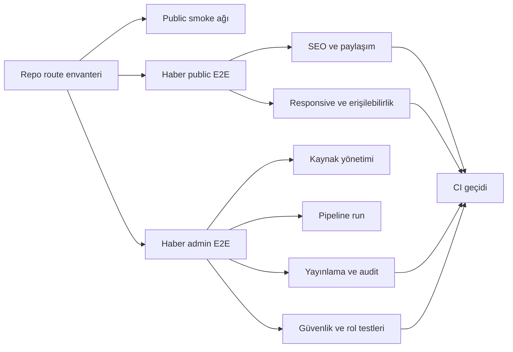
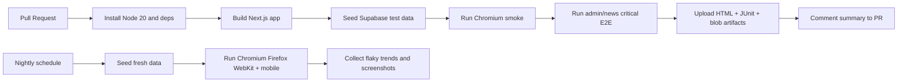
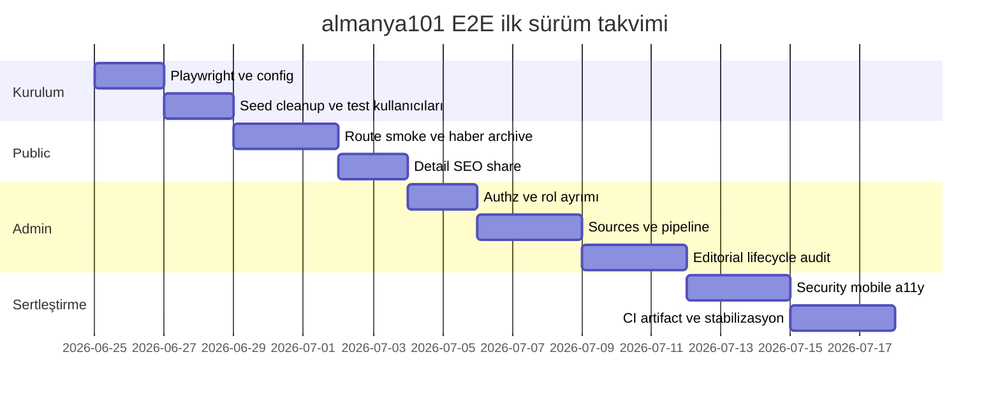

# almanya101 için ayrıntılı uçtan uca test dokümanı

## Okunan kaynaklar ve çalışma varsayımları

Bu çalışma için `ubterzioglu/last101` deposunda fiilen okunan ve rapora dayanak yapılan kaynaklar şunlardır: `README.md`, `package.json`, `news.md`, kök depo ağaç görünümü, `app/`, `app/(site)/`, `app/admin/`, `app/admin/haberler/` dizin görünümleri, `app/(site)/haberler/page.tsx`, `components/news/NewsArchiveClient.tsx` ve `components/news/NewsHeroCard.tsx`. Ayrıca kullanıcı tarafından eklenen mevcut referans doküman da okundu ve bölüm eşleme çalışmasında yapısal referans olarak kullanıldı. citeturn2view0turn4view0turn3view0turn7view0turn8view0turn9view0turn10view2turn14view0turn15view0turn15view1 fileciteturn0file0

Repo’nun teknik omurgası mevcut kanıta göre **Next.js 15 + React 19 + TypeScript + TailwindCSS + Vercel** ve **Supabase** bağımlılıklarıdır. README genel siteyi, `news.md` ise haber yönetimi ve pipeline katmanını açıkça Supabase tabanlı anlatır; `package.json` da `@supabase/ssr` ve `@supabase/supabase-js` bağımlılıklarını içerir. Bu nedenle bu raporun birincil E2E hedefi yalnız statik içerik regresyonu değil, aynı zamanda **public haber akışı + admin haber yönetimi + Supabase veri ve yetki akışı** olarak tanımlanmıştır. citeturn2view0turn4view0turn5view2

Bununla birlikte bazı ayrıntılar hâlâ belirsizdir. Örneğin admin oturum açma ekranı, branch bazlı preview dağıtım politikası, otomatik seed/reset komutları ve tam RLS migration’larının kendisi bu incelemede doğrudan okunamamıştır. Ayrıca README’de listelenen sayfalar ile güncel `app/(site)` ağaç yapısı bire bir örtüşmemektedir; bu da belgede drift olduğunu gösterir. Bu raporda, **gözlemlenebilen route ağacını README’ye göre daha güncel kabul ettim**, ancak içeriği doğrulanamayan modüller için tam iş kuralı testi yerine önce smoke/SEO/erişilebilirlik seviyesi E2E önerdim. citeturn2view0turn8view0turn9view0

Önemli bir teknik not daha var: README hâlâ Node.js `18.x or higher` diyorken, güncel Next.js kurulum dokümantasyonu App Router için asgari Node.js sürümünü `20.9` olarak verir. Bu nedenle E2E ve CI standardı olarak Node 20 LTS ya da üzeri alınmalıdır; aksi hâlde “lokalde çalışıyor, CI’da çalışmıyor” sınıfı hatalar kaçınılmaz olur. citeturn2view0turn30view0

## Yönetici özeti

`almanya101`, repo kanıtına göre yalnızca bir tanıtım sitesi değildir; güncel ağaç görünümü **public içerik modülleri**, **haber arşivi**, **çeşitli bilgi/karşılaştırma araçları** ve **admin modülleri** barındıran daha geniş bir Next.js uygulamasına işaret eder. Public tarafta `banka-secim`, `belgeler`, `haberler`, `hizmet-rehberi`, `maas-hesaplama`, `para-transferi`, `sigorta-secim`, `software-hub`, `stepstone-karsilastirma`, `vatandaslik-testi`, `vize-secim`, `yazi-dizisi` ve yazar sayfası benzeri route’lar; admin tarafında ise `haberler`, `hizmet-rehberi`, `home`, `recruitment-agencies`, `software-hub`, `yazi-dizisi` ve `broken-link-reports` modülleri görünmektedir. Bu kapsam, E2E stratejisinin yalnız `/haberler` ile sınırlı tutulmaması gerektiğini, ancak **derinlik seviyesinin modül başına farklılaştırılması** gerektiğini gösterir. citeturn8view0turn9view0

Bugün depoda görünür bir **kurumsal E2E iskeleti yoktur**. `package.json` içinde `test`, `e2e`, `playwright`, `cypress` veya CI odaklı bir iş akışı script’i görünmüyor; kök ağaçta `.playwright-mcp` klasörü görünse de bu, uygulamaya entegre edilmiş bir test suite’i olduğunu kanıtlamaz. Buna karşılık README ve `news.md`, haber modülü için net bir **manual test flow** tanımlar: kaynak ekleme, pipeline tetikleme, `pending_review` kayıtlarını görme, içeriği düzenleyip yayınlama ve public haber akışını doğrulama. Dolayısıyla en doğru yaklaşım, mevcut manuel haber akışını **önce Playwright tabanlı otomasyona çevirmek**, ardından diğer modüller için smoke ve regresyon kapsaması eklemektir. citeturn4view0turn22view1turn22view2turn22view3turn18view0

Haber modülü E2E açısından en değerli adaydır; çünkü repo içinde en iyi dokümante edilen iş akışı budur. `news.md`, sabit dört kategori, hero kartı, “Daha fazla yükle” akışı, detay sayfası, WhatsApp paylaşımı, kaynak CRUD’u, pipeline koşusu, duplicate önleme, `pending_review` akışı, admin/editor rol ayrımı, audit log, RLS, retention ve kabul kriterleri dahil olmak üzere uçtan uca test edilebilir net bir fonksiyonel sözleşme verir. Public haber sayfası kodu hero makalesi ve haber feed’ini server tarafında çeker; client bileşeni kategori değişimi ve load-more mantığını `/api/news` üzerinden yürütür; hero kartı da kategori etiketi, yayın tarihi, okuma süresi ve kaynak adı gibi alanları görünür kılar. Bu, E2E tasarımında “kullanıcı tarafından görülebilir davranışı test et” ilkesine çok uygundur. citeturn17view0turn17view1turn17view2turn18view0turn14view0turn15view0turn15view1turn26view0

Bu raporun ana önerisi şudur: **Phase-1 E2E kapsamını haber merkezi + admin haber paneli + güvenlik sınırları etrafında inşa edin; diğer route’ları smoke/SEO/erişilebilirlik kapsamasına alın; Phase-2’de modül derinliğini artırın.** Otomasyon çerçevesi olarak Playwright en uygun seçimdir; çünkü resmi dokümantasyonu lokatör, auto-waiting, retriable assertions, paralel worker, reporter ve CI entegrasyonu açısından doğrudan bu repo tipine hitap eder. Playwright ayrıca kullanıcı yüzeyine yakın rol/tabanlı seçicileri teşvik eder ve üçüncü taraf bağımlılıkların network düzeyinde taklit edilmesini önerir; bu da RSS, WhatsApp paylaşımı ve dış içerik akışları olan `almanya101` için özellikle önemlidir. citeturn26view0turn29view4turn29view5turn28view0turn28view2turn31view0turn31view2turn31view5

## Mevcut durum ve ekli dokümanla eşleme

Ekli referans doküman, yapısal olarak “yönetici özeti → kapsam → veri modeli → envanter → güvenlik/izleme → orkestrasyon → uygulama planı” akışını izleyen analitik bir sistem tasarım raporudur. Bu rapor, aynı disiplinli yapıyı `almanya101` için **E2E test perspektifine** çevirir. fileciteturn0file0

| Ekli dokümandaki bölüm/özellik | almanya101 için E2E karşılığı | Repo durumu | Kanıt ve yorum |
|---|---|---|---|
| Yönetici özeti | Test stratejisinin üst amaçları ve kabul tanımı | **Kısmi** | README genel ürün çerçevesini; `news.md` ise haber modülünün amaç ve ürün kararlarını verir. Ancak tek bir birleşik QA charter görünmüyor. citeturn2view0turn17view0 |
| Kapsam ve mevcut repo resmi | Route envanteri, modül sınıflandırması, dokümantasyon drift analizi | **Kısmi** | README’deki sayfalar ile `app/(site)` dizini tam örtüşmüyor; `app/admin` ayrıca geniş bir modül yüzeyi gösteriyor. Bu yüzden E2E kapsam haritası repodan türetilmeli. citeturn2view0turn8view0turn9view0 |
| Veri modeli / ingestion yaklaşımı | Test veri yönetimi, seed/reset, pipeline ve duplicate senaryoları | **Kısmi** | `news.md` ham kayıt, duplicate kontrolü, pending review ve retention kurallarını anlatıyor; ama depoda görünür bir resmi test seed/reset harness’i yok. citeturn17view0turn17view2turn17view3 |
| Araç envanteri | Public route’lar, admin route’lar, public API’ler, admin API’ler, edge/pipeline akışları | **Kısmi** | Route ve endpoint envanteri haber modülü için güçlü biçimde belgeli; diğer modüller için dizin var ama ayrıntılı sözleşme görünmüyor. citeturn8view0turn9view0turn10view2turn16view2 |
| Skorlama / gizlilik / yönetici deneyimi | Risk puanlama, erişim kontrolleri, RLS, rol matrisi, admin panel doğrulamaları | **Kısmi** | `news.md` admin/editor rol farkını, RLS sınırlarını, audit log gereksinimini ve dashboard uyarılarını açıkça veriyor. Ancak bunları doğrulayan otomasyon görünmüyor. citeturn17view1turn18view0 |
| Orkestrasyon / API sözleşmeleri | Public ve admin API tabanlı E2E akışları, cron ve manual pipeline | **Kısmi** | Haber modülü için public/admin endpoint listesi mevcut; manual pipeline ve cron fazları da belgeli. Ancak repo seviyesinde birleşik contract-test veya CI yok. citeturn16view2turn17view1turn18view0turn4view0 |
| Uygulama planı | Test rollout planı, fazlar, kabul kriterleri, rollback notları | **Mevcut** | `news.md` uygulama fazları, QA maddeleri ve kabul kriterlerini açıkça veriyor; README de verification commands ve rollback notları ekliyor. citeturn18view0turn22view3 |
| Gözlemlenebilirlik / anonim raporlama | HTML/JUnit/blob raporları, artifact saklama, flaky takibi, CI telemetry | **Eksik** | Repo içinde görünür Playwright reporter kurgusu, JUnit/artifact akışı veya test telemetrisi yok. Öneri tarafı bu raporda eklenmiştir. citeturn4view0turn22view2turn31view0turn31view1turn31view2 |

Repo gerçeğini E2E derinliği açısından sınıflandırınca daha net bir resim çıkıyor:

| Modül alanı | Doğrulanabilen durum | Önerilen E2E derinliği |
|---|---|---|
| Public haber merkezi | Route, public UI yapısı, filtre, load-more, detay ve hero görünümü doğrulanabiliyor. citeturn14view0turn15view0turn15view1turn17view0 | **Tam E2E** |
| Admin haber yönetimi | Queue, edit, kaynaklar, pipeline, ayarlar ve ilgili API’ler belgeli. citeturn10view2turn16view2turn18view0 | **Tam E2E** |
| Güvenlik sınırları | RLS, admin/editor rol matrisi, `service_role` sızıntı yasağı ve audit log beklentisi belgeli. citeturn17view1turn18view0turn29view3 | **Tam E2E + güvenlik smoke** |
| Diğer public modüller | Route ağacı var, iş kuralları sınırlı görünür. citeturn8view0 | **Smoke + SEO + erişilebilirlik** |
| Diğer admin modüller | Dizin düzeyi görünürlük var, ayrıntılı sözleşme yok. citeturn9view0 | **Guarded smoke** |
| CI ve test altyapısı | Görünür E2E script’i/iş akışı yok. citeturn4view0turn22view2 | **Eksik; önce kurulmalı** |

Bu tablo, E2E yatırımını da doğal biçimde yönlendirir: önce **haber modülü**, sonra **güvenlik sınırları**, ardından **repo genel smoke ağı**. citeturn22view3turn18view0

## Öncelikli boşluklar ve kapsanan senaryolar

Şu anki en büyük kalite açığı, haber modülü için ayrıntılı fonksiyonel dokümantasyon olmasına rağmen bunun otomasyona dönüşmemiş olmasıdır. README’de görülen test akışı hâlâ manuel; `package.json` içinde test ve E2E script’leri görünmüyor; kök ağaçta da standart bir `.github/workflows` görünmüyor. Bunun anlamı, bugün ekip yeni bir feature eklediğinde “hero bozuldu mu”, “duplicate koruması kırıldı mı”, “public kullanıcı ham RSS kayıtlarını görebiliyor mu”, “admin dışında kaynak eklenebiliyor mu” gibi temel risklerin sürekli olarak insan eliyle doğrulanmak zorunda olmasıdır. citeturn22view3turn4view0turn22view2

Aşağıdaki liste, eksik veya kısmi E2E senaryolarının **iş riski sırasına göre** önceliklendirilmiş hâlidir:

| Öncelik | Eksik/kısmi senaryo | Neden kritik | Bu raporda ayrıntılı mı |
|---|---|---|---|
| P0 | Public route smoke ve kırık sayfa avı | Route drift var; README ve `app/(site)` tam örtüşmüyor. citeturn2view0turn8view0 | Evet |
| P0 | `/haberler` hero + kategori filtre + load-more | Doğrudan kullanıcı yüzeyi; repo bunu çekirdek akış olarak tanımlıyor. citeturn14view0turn15view0turn17view0 | Evet |
| P0 | `/haberler/[slug]` detay + SEO + WhatsApp | Haber detay sayfası ve paylaşım kabul kriterlerinin merkezinde. citeturn16view2turn18view0 | Evet |
| P0 | Admin yetkilendirme ve rol ayrımı | Admin/editor farkı açıkça tanımlı; güvenlik sınırı ürün şartı. citeturn17view1 | Evet |
| P0 | Kaynak CRUD ve “test/run” akışı | Pipeline kalitesi bunun üzerine kurulu. citeturn10view2turn16view2 | Evet |
| P0 | Manuel pipeline run ve `pending_review` üretimi | README’deki ana manual flow’un kalbi. citeturn22view3turn17view2 | Evet |
| P0 | Duplicate önleme ve “no auto publish” kuralı | En kritik içerik kalitesi ve telif riski burada. citeturn17view0turn18view0 | Evet |
| P0 | Editör yaşam döngüsü: kaydet, yayınla, reddet, arşivle, hero, audit | Haber operasyonunun tamamı bunun üzerinde. citeturn17view1turn18view0 | Evet |
| P0 | RLS, secret leak ve ham veri erişim testi | `service_role` sızıntısı ve public veri sızıntısı doğrudan güvenlik kusurudur. citeturn17view1turn18view0turn29view3 | Evet |
| P1 | Mobil görünüm ve erişilebilirlik regresyonu | README erişilebilirlik uyumu iddia ediyor; haber QA listesinde mobil test var. citeturn2view0turn18view0 | Evet |
| P1 | Cron ve cleanup doğrulaması | Faz listesinde ve retention kurallarında yer alıyor. citeturn17view3turn18view0 | Kısmen |
| P1 | Bozuk RSS, yavaş kaynak, eksik API key hata toleransı | QA fazında açıkça istenmiş. citeturn18view0 | Evet |
| P2 | Diğer public modüller için derin iş-kuralı testleri | Route var ama iş kuralı görünürlüğü düşük. citeturn8view0 | Şimdilik smoke |
| P2 | Diğer admin modüller için tam CRUD otomasyonu | Dizin görünür, ayrıntılı spec yok. citeturn9view0 | Şimdilik smoke |

Aşağıdaki akış, önerilen E2E kapsam sınırını görselleştirir:



Bu mimaride **CI bloklayıcı** set yalnız P0 senaryolardan oluşmalıdır; P1 senaryoları ilkin nightly çalıştırılmalıdır. Playwright’ın bağımsız test yaklaşımı, retry’leri ve worker ayrımı da bunu destekler; flaky testleri geçici olarak izole edip üretim merge akışını gereksiz yere tıkamadan yönetmek mümkündür. citeturn26view0turn30view4turn28view0

## Ayrıntılı E2E senaryoları

### Public rota smoke ve kırık sayfa senaryosu

Bu senaryo, README ile gerçek route ağacı arasındaki drift nedeniyle zorunludur. En azından README’de listelenen public sayfalar ile `app/(site)` altında gözlenen modüllerin 200/OK ve temel içerik durumuna düştüğü doğrulanmalıdır. citeturn2view0turn8view0

| Alan | Ayrıntı |
|---|---|
| Önkoşullar | Preview veya staging ortamı yayında olmalı; test kullanıcısına ihtiyaç yok; izleme için temel HTTP log erişimi olmalı. |
| Test verisi | Route listesi iki kaynaktan türetilir: README’deki `/`, `/almanyada-yasam`, `/is-ilanlari`, `/rehber`, `/topluluk`, `/hakkimizda`, `/iletisim`; güncel route ağacındaki `banka-secim`, `belgeler`, `haberler`, `hizmet-rehberi`, `maas-hesaplama`, `para-transferi`, `sigorta-secim`, `software-hub`, `stepstone-karsilastirma`, `vatandaslik-testi`, `vize-secim`, `yazi-dizisi` ve yazar sayfaları. citeturn2view0turn8view0 |
| Yürütme | Her route için sayfaya git; `not-found` görünmediğini doğrula; ana başlık veya belirgin hero bölümünü kontrol et; console error ve uncaught exception yakala; 404/500 ağ cevaplarını fail say; sayfa yükleme süresi ve ilk meaningful paint’i rapora yaz. |
| Beklenen sonuç | Belgelenmiş veya route ağacında görülen tüm sayfalar 2xx ile açılır; global layout bozulmaz; kritik JS exception oluşmaz; public sayfalar mobil ve masaüstünde temel render verir. |
| Son koşullar | Smoke raporu route bazında başarı/başarısızlık listesi üretir; kırık route’lar backlog’a kırmızı etiketle eklenir. |
| Geri alma/temizlik | Bu test veri üretmez; yalnız rapor artifact’i saklanır. |

### Haber arşivi hero, filtre ve daha fazla yükle senaryosu

Haber arşivi sayfası kodu hero makale ve ilk feed’i server-side yükler; client bileşeni kategori filtresi, `limit=12` çağrısı ve cursor tabanlı “Daha fazla yükle” akışını `/api/news` üzerinden yürütür. Dört sabit kategori ve arama olmama kuralı da ayrıca belgelenmiştir. citeturn14view0turn15view0turn17view0turn18view0

| Alan | Ayrıntı |
|---|---|
| Önkoşullar | En az 1 featured haber ve en az 16 published haber seed edilmiş olmalı; kategoriler `almanya`, `turkiye`, `avrupa`, `dunya` olarak hazır olmalı. |
| Test verisi | Kategori başına en az 3 haber; bir featured haber; farklı published tarihleri; bir haber summary alanı dolu, biri boş; bir tanesi uzun başlıklı olmalı. |
| Yürütme | `/haberler` sayfasını aç; hero kartının render olduğunu doğrula; ilk listede 12 kayıt geldiğini ya da page size’a uygun sayıda kayıt gösterildiğini kontrol et; dört kategori filtresini tek tek seç; seçilen filtrede yalnız o kategoriye ait kayıtların göründüğünü kontrol et; “Daha fazla yükle” butonuna bas ve listenin append olduğunu, mevcut kayıtların silinmediğini doğrula; boş sonuç veren filtrede kullanıcı dostu mesajın göründüğünü doğrula. |
| Beklenen sonuç | Sayfada arama alanı yoktur; yalnız dört kategori görünür; hero kartı üstte tekil görünür; filtre değişiminde liste yenilenir; load-more mevcut listeye ekleme yapar; kayıtsız filtre için “Bu filtre için haber bulunamadı” mesajı çıkar. citeturn17view0turn15view0 |
| Son koşullar | Public haber cache’i ve cursor davranışı raporlanır; kategori bazlı UI snapshot’ları artifact’e eklenir. |
| Geri alma/temizlik | Seed edilen haberler test sonunda SQL veya admin utility ile temizlenir; featured işareti sıfırlanır. |

### Haber detay, SEO ve WhatsApp paylaşım senaryosu

Repo dokümantasyonu her published haber için benzersiz slug, canonical URL, Open Graph alanları, JSON-LD ve WhatsApp paylaşımını ister. Hero kart kodu kaynak adı ve okunma süresi gibi kullanıcıya görünür metadata’yı da yüzeye taşır. citeturn15view1turn17view2turn18view0

| Alan | Ayrıntı |
|---|---|
| Önkoşullar | En az bir published haber gerçekten `/haberler/[slug]` altında erişilebilir olmalı; haberin title, description, sourceName ve image alanları dolu olmalı. |
| Test verisi | Türkçe karakter içeren başlık; Latin olmayan ama slug’a dönüştürülebilir karakterler; cover image alt text; source URL; published timestamp. |
| Yürütme | `/haberler/<slug>` sayfasını aç; başlığın, özetin, kaynak adının ve tarih alanlarının göründüğünü doğrula; sayfada canonical link, title, meta description, Open Graph alanları ve JSON-LD script etiketlerini denetle; WhatsApp paylaşım düğmesine tıklandığında oluşturulan URL’nin ilgili haber başlığı ve linkini içerdiğini doğrula; arşivlenmiş içerik için gerekiyorsa `noindex` davranışını ayrı testte kontrol et. |
| Beklenen sonuç | Slug URL’si 200 döner; metadata beklenen habere aittir; canonical `https://almanya101.de/haberler/{slug}` kalıbına uyar; paylaşım linki doğru encode edilir; Türkçe karakterler URL dışı metinlerde bozulmaz. citeturn17view2turn18view0 |
| Son koşullar | Metadata doğrulama raporu ve paylaşım linki örnekleri saklanır. |
| Geri alma/temizlik | Test verisi aynı kalabilir; yalnız arşiv/noindex varyantı için kullanılan kayıt eski durumuna alınır. |

### Admin giriş, yetki ve rol ayrımı senaryosu

`news.md`, iki rol tanımlar: `admin` ve `editor`. Haber düzenleme ve yayınlama iki rol için de açıkken, kaynak ekleme/silme ve pipeline ayarı değiştirme yalnız admin’e açık olmalıdır. Ayrıca public kullanıcı ham veri tablolarına erişememelidir. Supabase dokümantasyonu da RLS açıldıktan sonra policy olmadan publishable key ile veri erişilemeyeceğini belirtir. citeturn17view1turn29view3

| Alan | Ayrıntı |
|---|---|
| Önkoşullar | Bir admin kullanıcı, bir editor kullanıcı ve yetkisiz public/cookie’siz oturum hazır olmalı; admin giriş yöntemi görünür değilse doğrudan storage state veya test helper kullanılmalı. |
| Test verisi | `admin_user`, `editor_user`, `anonymous`; erişim beklenen route listesi: `/admin/haberler`, `/admin/haberler/kaynaklar`, `/admin/haberler/pipeline`, `/admin/haberler/ayarlar`. |
| Yürütme | Yetkisiz kullanıcıyla ilgili admin route’lara git ve redirect/401/403 davranışını doğrula; editor ile haber listesi ve haber detayına girip düzenleme yetkisini doğrula; editor ile kaynak ekleme ve ayar değiştirme aksiyonlarını dene ve engellendiğini doğrula; admin ile aynı aksiyonların başarılı olduğunu doğrula. |
| Beklenen sonuç | Anonymous oturum admin yüzeyine giremez; editor kaynak/ayar yönetiminde bloke olur; admin kaynak ve ayar aksiyonlarını yapabilir; rol temelli UI butonları doğru görünür ya da görünmez. citeturn17view1 |
| Son koşullar | Role matrix doğrulama raporu oluşur; yetkisiz erişim denemeleri güvenlik logunda izlenebilir olmalıdır. |
| Geri alma/temizlik | Oluşturulan test kullanıcıları saklanabilir; kaynak ekleme yapıldıysa kaldırılır; ayar değiştirildiyse başlangıç değerine döndürülür. |

### Kaynak yönetimi ve kaynak test etme senaryosu

Admin haber paneli altında `kaynaklar` sayfası ve `GET/POST/PATCH /api/admin/news/sources`, ayrıca `POST /api/admin/news/sources/[id]/test` ile `run` endpoint’leri tanımlanmıştır. README’deki manual flow da ilk adım olarak en az bir RSS kaynağı eklemeyi ister. citeturn10view2turn16view2turn22view3

| Alan | Ayrıntı |
|---|---|
| Önkoşullar | Admin oturumu hazır olmalı; test için güvenli bir RSS fixture URL’si ya da stub edilmiş endpoint kullanılmalı. Dış servis bağımlılığını azaltmak için fixture/stub tercih edilmelidir. citeturn31view5 |
| Test verisi | Geçerli RSS URL’si, bozuk URL, timeout veren URL, pasif kaynak örneği, Türkçe karakter içeren kaynak adı. |
| Yürütme | `/admin/haberler/kaynaklar` aç; yeni kaynak oluştur; kaynak listesinde görünmesini doğrula; “test” aksiyonunu çalıştır ve başarılı doğrulama mesajını al; aynı kaynağı pasife al ve listede durum değişimini kontrol et; bozuk URL ile kaynak oluşturup test et ve kullanıcı dostu hata döndüğünü doğrula. |
| Beklenen sonuç | Admin geçerli kaynak ekleyebilir; kaynak pasife alınabilir; sağlıklı test koşusu başarılır; bozuk kaynakta tüm panel çökmez ve anlamlı hata mesajı gösterilir; Türkçe karakterli isimler bozulmaz. citeturn18view0 |
| Son koşullar | Test kaynakları listede işaretlenmiş olur; run history veya test sonucu izlenebilir biçimde görünür. |
| Geri alma/temizlik | Test için eklenen kaynaklar silinir ya da pasife alınır; fixture yönlendirmeleri kaldırılır. |

### Manuel pipeline, duplicate önleme ve hata toleransı senaryosu

Repo akışına göre admin panelindeki “Pipeline’ı şimdi çalıştır” eylemi Edge Function’ı tetikler; pipeline adayları ham tabloya alır, duplicate kontrolü yapar, `pending_review` draft’ları üretir, istenirse AI enrichment uygular, ama hiçbir haberi otomatik yayınlamaz. Hata durumunda bir kaynak bozulsa bile diğer kaynaklar işlenmeye devam etmelidir. QA fazı ayrıca bozuk RSS, yavaş kaynak ve API key eksik testlerini ister. citeturn17view0turn17view1turn17view2turn18view0

| Alan | Ayrıntı |
|---|---|
| Önkoşullar | En az iki kaynak tanımlı olmalı: bir sağlıklı fixture, bir duplicate üreten fixture; opsiyonel üçüncü kaynak hata üreten fixture olmalı; admin oturumu hazır olmalı. |
| Test verisi | Aynı canonical URL’ye düşen iki ham kayıt; timeout veren RSS; eksik `NEWS_PIPELINE_SECRET` veya AI kapalı/eksik key varyantı; daha önce işlenmiş unique hash örneği. |
| Yürütme | `/admin/haberler/pipeline` aç; manual run başlat; run tamamlandığında `/admin/haberler` kuyruğunda yeni `pending_review` kayıtları oluştuğunu doğrula; aynı kaynakları ikinci kez çalıştırıp duplicate kayıtların tekrar kuyruğa düşmediğini doğrula; hata veren kaynak senaryosunda diğer kaynaklardan draft üretiminin sürdüğünü doğrula; AI kapalıyken sistemin yine çalıştığını doğrula; hiçbir kaydın otomatik `published` olmadığını doğrula. |
| Beklenen sonuç | Başarılı kaynaklardan draft oluşur; duplicate kayıtlar yeniden işlenmez; bozuk/yavaş kaynak tüm pipeline’ı düşürmez; AI opsiyoneldir; sonuçlar `pending_review` statüsündedir, otomatik yayın yoktur. citeturn17view0turn17view2turn18view0 |
| Son koşullar | Pipeline run log’u, hata log’u ve duplicate istatistiği artifact olarak alınır; queue sayısı raporlanır. |
| Geri alma/temizlik | Test draft’ları archive/reject edilir ya da SQL cleanup ile silinir; run logları retention politikasına dokunulmadan bırakılabilir; test fixture’ları kaldırılır. |

### Editör yaşam döngüsü, görsel ve audit log senaryosu

Yayınlama, reddetme, arşivleme ve hero değiştirme işlemlerinin `news_editor_actions` tablosuna yazılması beklenir. Editör haber metnini düzenleyebilmeli, yayınlayabilmeli; görsel yalnız admin yüklemesi veya onaylı URL ile eklenmelidir; hero davranışı ve public görünüm de kabul kriteri içindedir. Ayrıca `news-covers` bucket ve dosya standardı tanımlıdır. citeturn17view1turn17view3turn18view0turn30view2

| Alan | Ayrıntı |
|---|---|
| Önkoşullar | `pending_review` durumunda en az bir draft olmalı; admin veya editor oturumu hazır olmalı; test görseli ve/veya onaylı görsel URL’si hazır olmalı. |
| Test verisi | Draft haber, WebP görsel, uzun özet, sourceName dolu kayıt, hero aday kaydı, ikinci bir yayında haber. |
| Yürütme | Draft detay sayfasını aç; başlık/özet/kategori/görsel alanlarını güncelle; taslağı kaydet; yayına al; public `/haberler` sayfasında görünürlüğünü kontrol et; haberi hero yap ve hero kartının değiştiğini doğrula; aynı haberi ardından archive et ve public yayından düştüğünü doğrula; ayrı bir draft üzerinde reject akışını çalıştır; mümkünse audit kayıtlarını UI üzerinden ya da admin veri doğrulamasıyla teyit et. |
| Beklenen sonuç | Kaydetme ve yayınlama başarılı olur; public sayfa güncellenir; hero seçimi tekil etki yaratır; archive edilen haber public’ten kalkar; reject edilen haber yayınlanmaz; işlem geçmişi audit kaydına yansır. citeturn17view1turn18view0 |
| Son koşullar | Public haber sayfasında beklenen hero ve yayın listesi oluşur; audit export veya ekran görüntüsü artifact’e eklenir. |
| Geri alma/temizlik | Yayınlanan test haberi archive edilir; hero işareti eski kayda döndürülür; yüklenen test görselleri bucket’tan silinir. |

### Güvenlik sınırları, secret sızıntısı ve public veri erişimi senaryosu

Bu senaryo kalite değil, doğrudan güvenlik kapısıdır. `news.md`, public kullanıcının yalnız published haberleri okuyabileceğini, ham kayıtlar ve ayarların kapalı kalacağını, `service_role` key’in tarayıcıya gitmeyeceğini söyler. Supabase dokümantasyonu da RLS açıldıktan sonra policy yoksa publishable key ile veri erişiminin kapalı olacağını net biçimde belirtir. README’de haber modülü için birçok gizli değişken tanımlıdır; GitHub Actions tarafında da secret yönetimi ve log masking doğru kurulmalıdır. citeturn17view1turn18view0turn29view3turn29view0

| Alan | Ayrıntı |
|---|---|
| Önkoşullar | Public oturum, editor oturumu ve admin oturumu hazır olmalı; staging build’in asset dosyaları ve network istekleri incelenebilir olmalı. |
| Test verisi | Published haber, raw item, pipeline settings kaydı, service role benzeri değer için sentinel string, public ve admin API istekleri. |
| Yürütme | Anonymous kullanıcıyla yalnız `/api/news` ve published detail uçlarını çağır; admin uçlarını anonim olarak çağırıp red davranışını doğrula; public tarayıcı bundle’ında `service_role`, `SUPABASE_SERVICE_ROLE_KEY`, `NEWS_PIPELINE_SECRET` desenlerini ara; public istemci ağ trafiğinde yalnız izinli uçların ve publishable key’in kullanıldığını doğrula; gerekiyorsa bundle text scan veya response header/body scan yap. |
| Beklenen sonuç | Anonymous yalnız published içerik görür; admin/raw/settings verisi görünmez; gizli anahtarlar HTML, JS bundle, client env veya network loglarında bulunmaz; admin uçları 401/403/redirect ile kapanır. citeturn17view1turn18view0turn29view3turn29view0 |
| Son koşullar | Security smoke raporu ve negatif test bulguları artifact’e eklenir; sentinel arama sonuçları saklanır. |
| Geri alma/temizlik | Veri oluşturulmaz; yalnız log artifact’leri saklanır. |

### Mobil görünüm, erişilebilirlik ve diğer modüller için paylaşımlı regresyon senaryosu

README sitenin mobile-first ve WCAG AA uyumlu olduğunu söyler; haber QA listesi de mobil görünüm ve Türkçe karakter testlerini zorunlu tutar. Playwright’ın rol tabanlı lokatörleri ve user-facing yaklaşımı bu tür kontroller için uygundur. Bu nedenle public haber akışı dışında kalan route’lar için de en azından responsive ve erişilebilirlik smoke ağı kurulmalıdır. citeturn2view0turn18view0turn26view0turn29view4

| Alan | Ayrıntı |
|---|---|
| Önkoşullar | Chromium desktop, iPhone 14 ve Pixel benzeri en az iki mobil project tanımlı olmalı; temel route listesi hazır olmalı. |
| Test verisi | Türkçe karakter içeren sayfa başlıkları; mobil menü/hero alanları; haber arşivi; seçili birkaç diğer public araç sayfası. |
| Yürütme | Mobil emülasyonda `/haberler` ve en az üç ek public route aç; yatay taşma, kırık layout, görünmeyen CTA ve üst üste binen text olup olmadığını kontrol et; klavye ile temel fokus akışını dene; ana heading, link, button ve form control’lerin rol/ad erişilebilirliğini baseline düzeyde denetle; Türkçe karakterlerin bozulmadığını doğrula. |
| Beklenen sonuç | Sayfalar mobilde kullanılabilir kalır; temel CTA’lar görünür ve tıklanabilir; keyboard focus kaybolmaz; ana semantik yapı erişilebilir rol/ad ile yakalanabilir; Türkçe karakterler doğru gösterilir. citeturn2view0turn18view0turn29view4 |
| Son koşullar | Mobil ekran görüntüleri ve erişilebilirlik bulgu listesi artifact’e yazılır. |
| Geri alma/temizlik | Veri değişmez; yalnız screenshot ve rapor dosyaları saklanır. |

## Ortam, otomasyon ve CI tasarımı

Bu repo için önerdiğim otomasyon omurgası **Playwright + GitHub Actions + Vercel preview + Supabase seed/reset** bileşimidir. Gerekçe nettir: repo zaten Next.js App Router uygulaması; Playwright resmi olarak kullanıcı-dostu lokatörleri, auto-waiting’i, bağımsız test izolasyonunu, retry’leri, worker tabanlı paralelliği ve HTML/JUnit/blob raporlarını destekler; GitHub Actions matrix ve concurrency ile browser/ortam çoğaltmayı yönetir; Supabase CLI yerelde aynı stack’i ayağa kaldırabilir; Vercel preview environment’ları da branch bazlı smoke koşuları için uygundur. citeturn26view0turn29view4turn29view5turn28view0turn28view2turn31view0turn31view1turn31view2turn29view1turn29view2turn29view7turn28view10

Aşağıdaki hedef ortam matrisi uygun olur:

| Katman | Öneri | Gerekçe |
|---|---|---|
| Local dev | Node 20 LTS, Playwright, `supabase init/start`, fixture RSS mock’ları | Next.js güncel gereksinimi ve Supabase local parity. citeturn30view0turn29view7turn30view3 |
| PR preview | Vercel preview + harici ama izole Supabase test projesi | Preview env vars branch bazında ayrılabilir. citeturn28view10turn28view11 |
| Merge gate | Chromium smoke + güvenlik smoke | En hızlı bloklayıcı set budur. citeturn28view0turn28view2 |
| Nightly | Chromium + Firefox + WebKit + mobil projeler | Playwright çoklu browser ve sharded rapor mantığına uygundur. citeturn26view2turn31view2 |
| Data | Seeded news, seeded users, stubbed RSS, temizlenebilir storage bucket | DB kontrollü test ve üçüncü taraf izolasyonu önerilir. citeturn31view4turn31view5 |

Önerilen klasör yapısı:

```text
e2e/
  smoke/
    public-routes.spec.ts
    admin-guards.spec.ts
  news/
    news-archive.spec.ts
    news-detail.spec.ts
    news-sources.spec.ts
    news-pipeline.spec.ts
    news-editorial.spec.ts
  security/
    rls-public-access.spec.ts
    secret-leak.spec.ts
  accessibility/
    mobile-layout.spec.ts
  fixtures/
    auth.ts
    news.ts
    rss.ts
  pages/
    admin-news.page.ts
    public-news.page.ts
  utils/
    seed.ts
    cleanup.ts
playwright.config.ts
scripts/
  e2e-seed.ts
  e2e-cleanup.ts
  e2e-smoke.sh
```

Bu yapıda naming standardı `alan.özellik.spec.ts` biçiminde olmalıdır. Örneğin `news-pipeline.spec.ts`, `news-editorial.spec.ts`, `admin-guards.spec.ts`. Böylece hem raporlamada hem shard ayrımında anlamlı test grupları elde edilir. Bu öneri, repo modül envanterinin doğrudan bir izdüşümüdür. citeturn8view0turn9view0turn10view2

Selector stratejisinde temel kural şudur: önce **role/name**, sonra gerekirse **explicit test id**. Playwright, `getByRole()` kullanımını erişilebilirlik algısına en yakın yöntem olarak önerir; `getByTestId()` ise en dayanıklı seçici yöntemi olarak tanımlanır ve özel attribute adı da ayarlanabilir. Bu repo için önerim, kritik admin ve haber UI öğelerinde `data-pw` standardının benimsenmesidir. Örnekler: `data-pw="news-source-create"`, `data-pw="news-pipeline-run"`, `data-pw="news-hero-card"`, `data-pw="news-load-more"`. Böylece kullanıcıya görünen metin değişse bile test kırılganlığı düşer. citeturn29view4turn31view3

Retry ve flaky politika önerim şöyledir: lokalde `retries: 0`, CI smoke için `retries: 1`, nightly için `retries: 2`; `workers` değeri CI’da başlangıçta `2`; stateful admin testlerinde serial değil ayrı seed-reset ile bağımsızlık korunmalı, serial ancak gerçekten birbirine bağlı adımlarda istisna olmalıdır. Playwright, worker bazlı izolasyonu ve retry sonrasında worker’ı sıfırlama davranışını açıkça tanımlar; bu yüzden testler mümkün olduğunca bağımsız tutulmalıdır. citeturn28view0turn30view4turn26view0

Üçüncü taraf bağımlılıkları için canlı uçlara güvenilmemelidir. Resmî Playwright yaklaşımı, kontrol etmediğiniz üçüncü tarafları test etmeyin; gerekirse network routing ile yanıtı garanti edin der. Bu repo için bunun pratik karşılığı, RSS ve TheNewsAPI/Gemini benzeri dış çağrıları yerel veya CI ortamında fixture/stub ile test etmek; canlı entegrasyon doğrulamasını ise daha seyrek çalışan contract/integration katmanına taşımaktır. Böylece E2E suite’inizin flaky olma ihtimali ciddi ölçüde azalır. citeturn31view5

Raporlama tarafında trio önerim **HTML + JUnit + blob** kombinasyonudur. HTML raporu ekip içi inceleme için, JUnit CI entegrasyonu için, blob raporu ise shard edilen koşuların sonradan birleştirilmesi için uygundur. citeturn31view0turn31view1turn31view2

Aşağıdaki akış önerilen CI modelini gösterir:



GitHub Actions/CI bağlantı checklist’i şöyle olmalıdır:

- repoya `@playwright/test` ve gerekli browser kurulumunu ekle,
- `playwright.config.ts` oluştur,
- `npm run e2e`, `npm run e2e:smoke`, `npm run e2e:headed`, `npm run e2e:report` script’lerini ekle,
- preview/staging için ayrı Supabase proje veya schema kullan,
- `NEXT_PUBLIC_*` ve server-side secret’ları ayrı yönet,
- `SUPABASE_SERVICE_ROLE_KEY`, `NEWS_PIPELINE_SECRET`, `GEMINI_API_KEY`, `THENEWSAPI_TOKEN` gibi değerleri GitHub Secrets/Vercel env olarak tanımla,
- workflow seviyesinde `concurrency` kullan ve aynı branch için eski koşuyu iptal et,
- browser matrix veya nightly matrix tanımla,
- HTML/JUnit/blob artifact upload et,
- PR merge gate’i yalnız smoke + P0 senaryolara bağla,
- nightly koşularda full browser matrix ve mobil emülasyonu çalıştır,
- branch protection kuralını en az smoke ve security suite’leri geçecek şekilde ayarla. citeturn18view0turn29view0turn29view1turn29view2turn28view10

## Yürütme planı ve risk yönetimi

Aşağıdaki efor tablosu, **ilk kurulum + ilk güvenilir sürüm** için gerçekçi bir tahmindir. Buradaki süreler “tek QA mühendisi + gerektiğinde 1 frontend/backend geliştirici desteği” varsayımıyla **ideal saat** cinsindendir; ilk kez Playwright entegre edecek bir ekipte bu tahminler genellikle %15–25 sapma gösterebilir. Bu tahminin temel nedeni, repoda görünür E2E/CI iskeletinin olmaması ve manuel haber akışının otomasyona dönüştürülecek olmasıdır. citeturn4view0turn22view3

| İş paketi | Tahmini efor |
|---|---:|
| Playwright, config, browser setup, temel reporter’lar | 10 saat |
| Seed/cleanup script’leri ve test kullanıcıları | 12 saat |
| Public route smoke suite | 6 saat |
| Haber archive suite | 8 saat |
| Haber detail + SEO/share suite | 6 saat |
| Admin authz/role suite | 8 saat |
| Sources CRUD/test suite | 8 saat |
| Pipeline success/failure/duplicate suite | 12 saat |
| Editorial lifecycle + image + audit suite | 12 saat |
| Security smoke suite | 8 saat |
| Mobile/accessibility suite | 8 saat |
| GitHub Actions workflow, artifact ve flaky yönetimi | 10 saat |
| Stabilizasyon, debug ve dokümantasyon | 10 saat |
| **Toplam** | **118 saat** |

Bu toplam yaklaşık **15 iş günü** eder. Eğer ekip ek olarak diğer public modüller için görsel regresyon ve ayrıntılı form/hesaplayıcı testleri de isterse ikinci faz için +6 ila +10 gün daha planlanmalıdır. Repo ağacında çok sayıda ek public/admin modül görünmesi, ikinci fazın potansiyel olarak oldukça genişleyeceğini gösterir. citeturn8view0turn9view0

Önerilen takvim aşağıdaki gibidir:



Ana riskler ve mitigasyonları aşağıdadır:

| Risk | Etki | Olasılık | Azaltım |
|---|---|---|---|
| README ile route ağacı arasında drift | Yanlış kapsam, eksik test | Yüksek | Route envanterini build zamanında `app/` ağacından üret; smoke suite’i bu envanteri kullansın. citeturn2view0turn8view0 |
| Seçici kırılganlığı | Sık flaky test | Yüksek | Role/name öncele; kritik aksiyonlarda `data-pw` standardı ekle. citeturn29view4turn31view3 |
| Dış RSS ve üçüncü taraf bağımlılıkları | Non-deterministic test | Yüksek | Fixture/stub kullan; canlı entegrasyonu ayrı katmana taşı. citeturn31view5 |
| Admin rol modeli görünürlüğünün sınırlı olması | Yanlış authz testi | Orta | İlk sprintte test kullanıcıları ve erişim matrisini netleştir; seed script’i bunu üretmeli. citeturn17view1 |
| Secret sızıntısı ve yanlış env yönetimi | Yüksek güvenlik riski | Orta | GitHub Secrets/Vercel env ayrımı, masking, bundle scan ve negatif test. citeturn29view0turn28view10 |
| RLS eksikliği veya bozuk policy | Public veri sızıntısı | Orta | P0 security smoke; published dışı veriye public erişim testleri. citeturn29view3turn17view1 |
| Cron ve preview ortam zamanlaması | Gece testlerinde yalancı hata | Orta | Cron senaryolarını manual trigger ile doğrula; gerçek cron doğrulamasını nightly ve gözlem katmanına taşı. citeturn17view1turn17view3 |

## Kod örnekleri ve önerilen yol haritası

Aşağıdaki örnekler, bu repo için tavsiye ettiğim Playwright yaklaşımının pratik başlangıç iskeletini gösterir. Kod stili, Playwright’ın role/test-id lokatörleri, auto-waiting, retry ve reporter özellikleriyle uyumludur. citeturn29view4turn29view5turn28view2turn31view0turn31view1

### Örnek Playwright yapılandırması

```ts
// playwright.config.ts
import { defineConfig, devices } from '@playwright/test';

export default defineConfig({
  testDir: './e2e',
  timeout: 45_000,
  expect: {
    timeout: 8_000,
  },
  fullyParallel: false,
  forbidOnly: !!process.env.CI,
  retries: process.env.CI ? 1 : 0,
  workers: process.env.CI ? 2 : undefined,
  reporter: [
    ['html', { open: 'never', outputFolder: 'playwright-report' }],
    ['junit', { outputFile: 'artifacts/junit/results.xml' }],
    ['blob'],
  ],
  use: {
    baseURL: process.env.BASE_URL || 'http://127.0.0.1:3000',
    trace: 'retain-on-failure',
    video: 'retain-on-failure',
    screenshot: 'only-on-failure',
    testIdAttribute: 'data-pw',
  },
  projects: [
    { name: 'chromium', use: { ...devices['Desktop Chrome'] } },
    { name: 'firefox', use: { ...devices['Desktop Firefox'] } },
    { name: 'webkit', use: { ...devices['Desktop Safari'] } },
    { name: 'iphone', use: { ...devices['iPhone 14'] } },
  ],
});
```

### Örnek haber arşivi testi

```ts
// e2e/news/news-archive.spec.ts
import { test, expect } from '@playwright/test';

test.describe('Haber arşivi', () => {
  test('hero, filtre ve daha fazla yükle akışı çalışır', async ({ page }) => {
    await page.goto('/haberler');

    await expect(page.getByRole('heading', { name: /haberler/i })).toBeVisible();

    const hero = page.getByTestId('news-hero-card');
    await expect(hero).toBeVisible();

    await page.getByRole('button', { name: /almanya/i }).click();
    await expect(page.getByTestId('news-list')).toBeVisible();

    const cardsBefore = await page.getByTestId('news-list-card').count();

    const loadMore = page.getByRole('button', { name: /daha fazla yükle/i });
    if (await loadMore.isVisible()) {
      await loadMore.click();
      await expect
        .poll(async () => page.getByTestId('news-list-card').count())
        .toBeGreaterThan(cardsBefore);
    }
  });
});
```

### Örnek admin yetki testi

```ts
// e2e/smoke/admin-guards.spec.ts
import { test, expect } from '@playwright/test';

test('anon kullanıcı admin haber paneline erişemez', async ({ page }) => {
  await page.goto('/admin/haberler');
  await expect(page).not.toHaveURL(/\/admin\/haberler$/);
});

test('editor kaynak ayarlarını değiştiremez', async ({ page, context }) => {
  // storageState veya helper ile editor oturumu yüklenir
  await context.addCookies([
    // örnek; gerçek projede fixture kullanılmalı
  ]);

  await page.goto('/admin/haberler/kaynaklar');
  await expect(page.getByRole('button', { name: /yeni kaynak/i })).toBeHidden();
});
```

### Örnek pipeline senaryosu için hibrit yaklaşım

```ts
// e2e/news/news-pipeline.spec.ts
import { test, expect } from '@playwright/test';
import { seedSources, cleanupNewsFixtures } from '../utils/seed';

test.describe('Haber pipeline', () => {
  test.beforeEach(async () => {
    await seedSources({ healthy: true, duplicate: true, broken: true });
  });

  test.afterEach(async () => {
    await cleanupNewsFixtures();
  });

  test('manual run pending_review üretir ve duplicate haberi tekrar kuyruğa sokmaz', async ({ page }) => {
    await page.goto('/admin/haberler/pipeline');

    await page.getByRole('button', { name: /şimdi çalıştır/i }).click();
    await expect(page.getByText(/başarı|tamamlandı/i)).toBeVisible();

    await page.goto('/admin/haberler');
    await expect(page.getByTestId('news-status-pending-review')).toHaveCountGreaterThan(0);

    const firstRunCount = await page.getByTestId('news-status-pending-review').count();

    await page.goto('/admin/haberler/pipeline');
    await page.getByRole('button', { name: /şimdi çalıştır/i }).click();

    await page.goto('/admin/haberler');
    const secondRunCount = await page.getByTestId('news-status-pending-review').count();

    expect(secondRunCount).toBeLessThanOrEqual(firstRunCount + 1); // sadece gerçekten yeni içerik varsa artabilir
  });
});
```

### Örnek GitHub Actions iş akışı

```yaml
name: e2e

on:
  pull_request:
  push:
    branches: [main]

concurrency:
  group: e2e-${{ github.workflow }}-${{ github.ref }}
  cancel-in-progress: true

jobs:
  e2e-smoke:
    runs-on: ubuntu-latest
    timeout-minutes: 30
    strategy:
      matrix:
        project: [chromium]
    steps:
      - uses: actions/checkout@v4

      - uses: actions/setup-node@v4
        with:
          node-version: 20
          cache: npm

      - run: npm ci
      - run: npx playwright install --with-deps

      - name: Prepare env
        run: cp .env.example .env.local

      - name: Seed test data
        run: node scripts/e2e-seed.ts
        env:
          NEXT_PUBLIC_SUPABASE_URL: ${{ secrets.NEXT_PUBLIC_SUPABASE_URL }}
          NEXT_PUBLIC_SUPABASE_ANON_KEY: ${{ secrets.NEXT_PUBLIC_SUPABASE_ANON_KEY }}
          SUPABASE_SERVICE_ROLE_KEY: ${{ secrets.SUPABASE_SERVICE_ROLE_KEY }}

      - name: Run smoke suite
        run: npx playwright test --project=${{ matrix.project }} e2e/smoke e2e/news/news-archive.spec.ts

      - name: Upload report
        if: always()
        uses: actions/upload-artifact@v4
        with:
          name: playwright-report-${{ matrix.project }}
          path: |
            playwright-report
            artifacts/junit
            blob-report
```

Önerilen yol haritası kısa ve nettir. İlk sprintte framework, seed/reset ve `public route smoke + haber archive` devreye alınmalıdır. İkinci sprintte `detail + admin authz + sources` tamamlanmalıdır. Üçüncü sprintte `pipeline + editorial lifecycle + security smoke` üretim merge gate’i hâline getirilmelidir. Dördüncü sprintte mobil/erişilebilirlik, nightly browser matrisi ve flaky azaltma işi yapılmalıdır. Bu sıralama, repo içinde en açık sözleşmesi olan haber modülünden başlayıp en yüksek iş/güvenlik riskli noktaları önce kapatır. citeturn22view3turn17view2turn18view0turn26view0turn29view2

Son tavsiyem şudur: `almanya101` için **ilk başarı ölçütü “çok test yazdık” değil, “haber modülünün manuel akışı artık CI’da deterministik olarak doğrulanıyor”** olmalıdır. Bunun için bir sonraki en doğru adım, aynı gün içinde uygulanabilecek şu beş aksiyondur: `@playwright/test` eklemek, `playwright.config.ts` oluşturmak, P0 senaryolar için `data-pw` attribute’larını koymak, seed/cleanup script’lerini yazmak ve GitHub Actions üzerinden yalnız Chromium smoke koşusunu ayağa kaldırmak. Bu beş adım tamamlandığında repo ilk kez gerçekten **E2E çalıştırılabilir** bir kalite kapısına sahip olacaktır. citeturn4view0turn22view2turn31view3turn29view1turn29view2