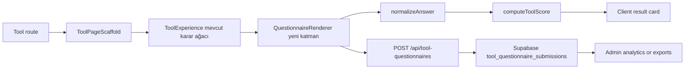
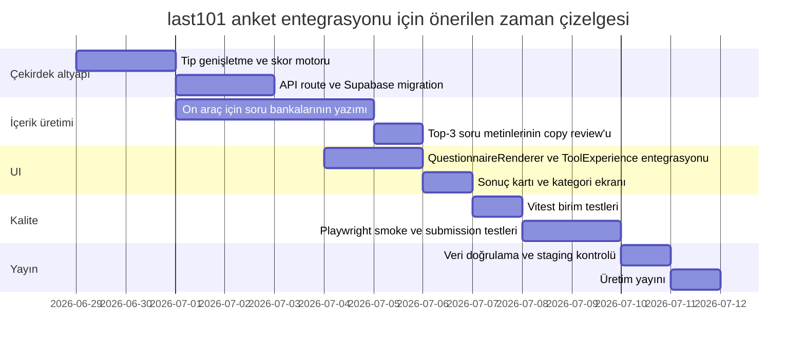

# last101 deposu için son on araçta 15 soruluk anket entegrasyonu

## Yönetici Özeti

`ubterzioglu/last101`, Next.js App Router ve TypeScript ile kurulmuş, Supabase entegrasyonu ve Playwright smoke testleri bulunan bir depo. Kök ağaçta `app`, `components`, `constants`, `docs`, `e2e`, `lib`, `scripts`, `supabase` ve `types` klasörleri yer alıyor; ayrıca depo ana sayfası 216 commit ve 0 açık issue gösteriyor. README, uygulamanın genel iskeletini; `package.json` ise Next.js 15, React 19, Supabase istemcileri ve Playwright tabanlı test yapısını doğruluyor. citeturn1view0turn17view0

Depoda “son 10 araç” ifadesini tanımlarken en güçlü repo-içi sinyal, `docs/almanya-araclari-ozet.md` dosyasındaki **“10 ayrı interaktif araç”** listesi ve bu rotaları hedefleyen `e2e/smoke/almanya-tools.spec.ts` ile `public-routes.spec.ts` dosyaları oldu. Bu nedenle “last 10” ifadesini şu 10 halka açık araç olarak kabul etmek en savunulabilir yorumdur: `almanya-yolunu-sec`, `almanya-maas-beklentisi`, `almanyaya-hazir-misin`, `hangi-sehir-sana-uygun`, `topluluk-ve-danismanlik`, `kariyer-ve-egitim-rotasi`, `almanya-yasam-tarzi-uyumu`, `ilk-90-gun-planlayici`, `once-hangi-sorunu-cozmelisin`, `almanyada-is-bulma-olasiligi`. Aynı test dosyaları, daha eski 8 etkileşimli aracın giriş gerektirdiğini; bu 10 aracın ise anonim olarak erişilebilir olduğunu da gösteriyor. citeturn16view0turn29view0turn29view1

Mevcut mimari, araçları `ToolConfig` tanımı ve `ToolExperience` istemci bileşeni üzerinden çalıştırıyor. Bu yapı bugün yalnızca mevcut karar ağacını (`questions`, `options`, `ToolState`) destekliyor; anket tanımı, cevap saklama şeması ve kalıcı depolama için ayrı bir soru-cevap sözleşmesi bulunmuyor. Ayrıca yeni 10 aracın yalnızca biri (`almanya-yolunu-sec`) zaten 15 soruluk bir akışa sahip; geri kalanlarının çoğu 4–5 soruluk kısa karar ağaçları. Bu yüzden en düşük riskli ve geriye dönük uyumlu çözüm, mevcut karar motorunu koruyup her araç için ayrı bir **15 soruluk yapılandırılmış değerlendirme katmanı** eklemektir. citeturn17view1turn17view3turn21view1turn26view0turn26view1turn26view2turn26view3turn28view0turn28view1turn28view2turn28view3turn23view0

Bu raporun önerisi şudur: mevcut araç sayfaları korunmalı; her araç konfigürasyonuna `questionnaire` alanı eklenmeli; 15 soruluk anketler `lib/tools/surveys/*` altında yapılandırılmalı; istemci tarafında puanlama motoru çalışmalı; sonuç ve cevap özetleri Next.js API route üzerinden Supabase’e kaydedilmeli; ayrıca mevcut Playwright suite’ine ve yeni bir küçük unit-test katmanına anket doğrulamaları eklenmelidir. Böylece mevcut kullanıcı akışı bozulmadan, daha ölçülebilir ve analitik olarak işlenebilir bir değerlendirme katmanı eklenmiş olur. citeturn17view0turn17view1turn17view3turn29view0

## Depo Yapısı ve Mevcut Mimari

README ve depo ağaç çıktısı birlikte okunduğunda, uygulama omurgası App Router üzerinde: `app` rota katmanı, `components` tekrar kullanılabilir UI, `lib` yardımcı mantık, `constants` statik veri, `e2e` Playwright testleri, `scripts` yardımcı komutlar ve `supabase` veritabanı/fonksiyon alanı olarak ayrılmış durumda. README’de daha sade bir iskelet verilse de canlı depo ağacı bunun üstüne haber modülü, admin alanları ve çeşitli iş akışları eklendiğini gösteriyor. citeturn1view0turn3search0

Araç altyapısı `lib/tools/types.ts`, `lib/tools/catalog.ts`, `lib/tools/helpers.ts`, `components/tools/ToolPageScaffold.tsx` ve `components/tools/ToolExperience.tsx` çevresinde kurulmuş. `ToolConfig` içinde başlık, açıklama, soru akışı, SSS, resmi kaynaklar ve sonuç çözücü fonksiyon tanımlanıyor. `ToolExperience` ise istemci tarafında `useState` ile cevapları topluyor, skor/fact/tag biriktiriyor, sonucu hesaplıyor ve sıfırlama/geri alma işlemlerini yapıyor. Burada dikkat çeken nokta, kalıcı kayıt veya anket yanıtı nesnesi için ayrı bir veri modelinin bulunmaması. citeturn17view1turn17view2turn17view3turn29view2turn29view3

`docs/almanya-araclari-ozet.md`, bu yeni araç kümesinin “ortak araç altyapısı + veri odaklı konfigürasyon” yaklaşımıyla geliştirildiğini, `ToolExperience` ve `ToolPageScaffold` etrafında tekrar kullanılabilir bir çatı kurulduğunu açıkça söylüyor. Aynı belge, bu iş kapsamında yeni smoke test dosyasının eklendiğini ve 10 aracın tamamının public route olarak açıldığını doğruluyor. Bu da anket entegrasyonunda en verimli noktanın tek tek sayfa rewrite etmek değil, ortak tipler ve ortak render katmanını genişletmek olduğunu gösteriyor. citeturn16view0turn29view0

Mevcut soru sayıları araçlar arasında ciddi biçimde değişiyor. `almanya-yolunu-sec` zaten 15 soruluk sabit akış türünde; `almanya-maas-beklentisi`, `topluluk-ve-danismanlik`, `ilk-90-gun-planlayici` ve `once-hangi-sorunu-cozmelisin` 4 soruda; `almanyaya-hazir-misin`, `hangi-sehir-sana-uygun`, `kariyer-ve-egitim-rotasi`, `almanya-yasam-tarzi-uyumu` ve `almanyada-is-bulma-olasiligi` ise 5 soruda sonuç üretiyor. Bu fark, tüm araçları bir anda yeni 15 soruluk karar ağacına çevirmek yerine “mevcut sonuç motoru + ek ölçüm anketi” modelini teknik olarak daha güvenli kılıyor. citeturn21view1turn26view0turn26view1turn26view2turn26view3turn28view0turn28view1turn28view2turn28view3turn23view0

`package.json` tarafında Playwright mevcut, fakat Vitest/Jest benzeri bir unit-test kütüphanesi görünmüyor. Bu yüzden önerdiğim entegrasyon planında ya Node’un yerleşik test runner’ı ya da Vitest eklenmeli. Ben örnek yamalarda Vitest kullanıyorum; çünkü saf tip düzeyi ve puanlama fonksiyonu testleri için en ergonomik çözüm bu olacak. citeturn17view0

## Son On Araç ve Tasarım İlkeleri

Aşağıdaki 10 araç, repo içindeki “Yeni Araçlar” dokümanı, public route smoke testi ve araç kataloğu birlikte okunarak “son 10 eklenen araç” olarak seçildi: **Almanya Yolunu Seç**, **Almanya Maaş Beklentisi**, **Almanya’ya Hazır Mısın?**, **Hangi Şehir Sana Uygun?**, **Topluluk ve Danışmanlık Eşleştirici**, **Kariyer ve Eğitim Rotası**, **Almanya Yaşam Tarzı Uyumu**, **İlk 90 Gün Planlayıcı**, **Önce Hangi Sorunu Çözmelisin?**, **Almanya’da İş Bulma Olasılığı**. Repo ayrıca daha eski ve login-gated araçlar da içeriyor; ancak bunlar test dosyasında ayrı grupta tutuluyor. Bu nedenle kapsamı yeni public araç setiyle sınırlamak teknik olarak temiz, ürün açısından da kullanıcıya görünür etkisi en yüksek tercih. citeturn16view0turn17view2turn29view0turn29view1

Anket tasarımında şu ilkeleri kullandım. Birincisi, her araç için 15 soru önerisi aracın `description`, `whoFor` ve `howItWorks` alanlarından türetildi; yani sorular soyut UX anketi değil, mevcut iş mantığını daha derin ve ölçülebilir hale getiren değerlendirme öğeleri olarak kuruldu. İkincisi, ağırlıklar her araçta toplamı 1.00 edecek biçimde sabitlendi: `0.10, 0.09, 0.08, 0.08, 0.07, 0.07, 0.07, 0.07, 0.06, 0.06, 0.06, 0.05, 0.05, 0.05, 0.04`. Bu dağılım, çekirdek belirleyicileri öne çıkarırken daha ikincil sinyallerin skoru domine etmesini engelliyor. Üçüncüsü, skor mantığı araç bağımsız bir çekirdek motorla normalize ediliyor: her cevap 0–100 aralığına çevriliyor, sonra soru ağırlığıyla çarpılıp toplanıyor. citeturn17view2turn21view2turn26view0turn26view1turn26view2turn26view3turn28view0turn28view1turn28view2turn28view3turn23view0

Aşağıdaki tasarımda “puan” iki şey üretir: önce **araç içi uygunluk/güven skoru**, sonra da istenirse çapraz araç analitiği için **boyutsal skorlar**. Örneğin `almanyaya-hazir-misin` için “hazırlık”, `almanyada-is-bulma-olasiligi` için “rekabet gücü”, `hangi-sehir-sana-uygun` için “şehir uyumu”, `ilk-90-gun-planlayici` için “operasyonel hazırlık” çıkar. Bu model, mevcut karar ağacını bozmadan ona ikinci bir analitik katman ekler. citeturn24view1turn23view0turn28view0turn28view2turn17view3

## Araç Bazında 15 Soruluk Anket Tasarımı

Aşağıdaki tablolar, her araç için önerilen 15 soruluk değerlendirme katmanını veriyor. Bu öneriler mevcut repo içindeki amaç/persona tanımlarına dayalıdır; dolayısıyla her tablo, var olan kısa karar akışını bozmadan onu derinleştirmek üzere tasarlanmıştır. citeturn17view2turn21view2turn24view0turn24view1turn28view0turn26view2turn26view3turn28view1turn28view2turn28view3turn23view0

**Almanya Yolunu Seç** — araç; hangi ana rota ile başlanması gerektiğine karar veremeyen, hedef, teklif, yeterlilik, dil ve bütçe sinyallerini tek bir çerçevede görmek isteyen kullanıcıları hedefliyor. Mevcut sürüm zaten 15 soruluk bir akış kullanıyor; aşağıdaki 15 soru, bunu daha ölçülebilir ve raporlanabilir hale getiren puanlanabilir bir questionnaire katmanı olarak tasarlandı. citeturn21view2turn21view1

| Soru | Tür | Skorlama | Ağırlık | Gerekçe |
|---|---|---|---:|---|
| Almanya’ya gitmekteki ana amacın ne kadar net? | Likert 1–5 | `(x-1)/4*100` | 0.10 | Rota netliği çekirdek sinyal. |
| Elinde somut iş teklifi/kabul mektubu var mı? | Çoktan seçmeli | Yok=0, Süreçte=50, Var=100 | 0.09 | Başlangıç rotasını dramatik etkiler. |
| Diploma/mesleki yeterliliklerin ne kadar belirgin? | Likert 1–5 | direkt | 0.08 | Tanınabilir profil önemlidir. |
| Denklik/tanınma gereksinimini ne kadar biliyorsun? | Likert 1–5 | direkt | 0.08 | Evrak uyumu rota seçimi için kritik. |
| Almanca seviyen nedir? | Çoktan seçmeli | Yok=0, A1/A2=25, B1=60, B2+=100 | 0.07 | Özellikle iş ve Ausbildung için belirleyici. |
| İngilizce ile profesyonel ilerleyebilir misin? | Çoktan seçmeli | Zayıf=20, Orta=60, Güçlü=100 | 0.07 | Bazı rotalarda tamamlayıcı kaldıraç. |
| Taşınma ve ilk aylar için birikimin ne kadar yeterli? | Çoktan seçmeli | <1 ay=0, 1–2 ay=40, 3–5 ay=75, 6+ ay=100 | 0.07 | Finansman kırılganlığı azaltır. |
| Öğrencilik veya Ausbildung fikrine açıklığın nedir? | Likert 1–5 | direkt | 0.07 | Alternatif giriş yollarını etkiler. |
| Freelance/bağımsız çalışma için portföyün hazır mı? | Çoktan seçmeli | Hayır=0, Kısmen=50, Evet=100 | 0.06 | Niş rota olasılığını ölçer. |
| Almanya’da aile/partner bağlantın var mı? | Çoktan seçmeli | Yok=0, Zayıf=40, Güçlü=100 | 0.06 | Aile birleşimi hattını etkiler. |
| Yaşadığın şehir/ülke dışında başvuru ve taşınma esnekliğin var mı? | Likert 1–5 | direkt | 0.06 | Şans kartı ve iş arama esnekliği. |
| Mesleki deneyimini belgeleyebiliyor musun? | Likert 1–5 | direkt | 0.05 | BT uzmanı ve uzman rota için gerekli. |
| Hedef rotanın hukuki/oturum tarafını ne kadar araştırdın? | Likert 1–5 | direkt | 0.05 | Yanlış rota riskini azaltır. |
| Önümüzdeki 6 ay içinde harekete geçmeye ne kadar hazırsın? | Likert 1–5 | direkt | 0.05 | Zamanlama ve uygulama ciddiyeti. |
| CV, pasaport, diploma, çeviri dosyan ne kadar hazır? | Likert 1–5 | direkt | 0.04 | Uygulanabilirlik kontrolü. |

**Almanya Maaş Beklentisi** — araç, iş görüşmesine girmeden önce hedef maaş bandını, şehir farklarını ve brüt-net etkisini kabaca anlamak isteyen kullanıcılar için tasarlanmış. Mevcut akış 4 soru; yeni katman maaş beklentisini daha sağlam veriye dayalı hale getirir. citeturn24view0turn26view0

| Soru | Tür | Skorlama | Ağırlık | Gerekçe |
|---|---|---|---:|---|
| Ana meslek grubun piyasa karşılığı açısından ne kadar net? | Likert 1–5 | direkt | 0.10 | Taban maaşın ana belirleyicisi. |
| Deneyim seviyen ne? | Çoktan seçmeli | 0–2y=35, 3–5y=70, 6+y=100 | 0.09 | Seniority pazarlığı belirler. |
| Hedeflediğin şehir tipi ne kadar net? | Likert 1–5 | direkt | 0.08 | Lokasyon maliyet baskısını belirler. |
| Brüt ve net maaş farkını ne kadar iyi biliyorsun? | Likert 1–5 | direkt | 0.08 | Beklenti hatasını azaltır. |
| Mevcut veya son maaşını Alman piyasasıyla kıyasladın mı? | Çoktan seçmeli | Hayır=0, Kısmen=50, Evet=100 | 0.07 | Anchoring hatasını azaltır. |
| Yan hakları toplam paket içinde ne kadar hesaba katıyorsun? | Likert 1–5 | direkt | 0.07 | Karar kalite sinyali. |
| Türkiye/başka ülke maaşını doğrudan çevirmeye ne kadar eğilimlisin? | Likert 1–5 ters | `(5-x)/4*100` | 0.07 | Yanlış kıyas riskini ölçer. |
| Hane yapın vergi etkisini ne kadar değiştiriyor? | Çoktan seçmeli | Bilmiyorum=25, Tahmini biliyorum=60, Net biliyorum=100 | 0.07 | Net gelir tahmini için kritik. |
| Pazarlıkta rol kapsamı ve sorumluluğu kullanabiliyor musun? | Likert 1–5 | direkt | 0.06 | Salt rakam yerine değer pazarlığı. |
| Uzaktan/hibrit esnekliğin var mı? | Çoktan seçmeli | Yok=20, Kısmi=60, Yüksek=100 | 0.06 | Şehir maliyeti baskısını dengeler. |
| Almanca seviyen maaş beklentine nasıl etki eder, biliyor musun? | Likert 1–5 | direkt | 0.06 | Rol seviyesiyle ilişkili. |
| Taşınma desteği/bonus gibi kalemleri isteme konforun var mı? | Likert 1–5 | direkt | 0.05 | Toplam paketi artırır. |
| Hedef sektöründeki benzer ilanları düzenli izliyor musun? | Likert 1–5 | direkt | 0.05 | Piyasa gerçekçiliği. |
| Yaşam maliyeti baskısını kira üzerinden ayrıca hesaplıyor musun? | Çoktan seçmeli | Hayır=0, Kabaca=60, Detaylı=100 | 0.05 | Şehir seçimiyle bağlantılı. |
| Maaş beklentini yıllık brüt olarak ifade etmeye hazır mısın? | Boolean | Evet=100, Hayır=0 | 0.04 | Almanya pazarıyla uyum. |

**Almanya’ya Hazır Mısın?** — araç; başvuru ve taşınma öncesinde evrak, dil, finansman, konaklama ve denklik zayıflıklarını görmek isteyen kullanıcıları hedefliyor. Mevcut akış 5 soru ve “hazır/kısmen/kritik açık” mantığıyla çalışıyor. citeturn24view1turn26view1

| Soru | Tür | Skorlama | Ağırlık | Gerekçe |
|---|---|---|---:|---|
| Pasaport ve temel kimlik evrakların hazır mı? | Çoktan seçmeli | Hayır=0, Kısmen=50, Evet=100 | 0.10 | Temel giriş bariyeri. |
| Diploma/sertifika/özgeçmiş paketini toparladın mı? | Likert 1–5 | direkt | 0.09 | Başvuru omurgası. |
| Yeminli çeviri ve apostil ihtiyacını netleştirdin mi? | Likert 1–5 | direkt | 0.08 | Süreç gecikmesini azaltır. |
| Almanca hazırlığın hedef rotana yeterli mi? | Çoktan seçmeli | Hayır=0, Sınırda=50, Yeterli=100 | 0.08 | Dil açığı kritik risk. |
| Taşınma + ilk aylar için finansal tamponun var mı? | Çoktan seçmeli | <1 ay=0, 1–2 ay=40, 3–5 ay=75, 6+ ay=100 | 0.07 | Finansman kırılmasını önler. |
| İlk konaklama planın ne kadar net? | Likert 1–5 | direkt | 0.07 | Varış sonrası sürtünmeyi belirler. |
| Sağlık sigortası yükümlülüğünü ne kadar biliyorsun? | Likert 1–5 | direkt | 0.07 | Operasyonel hazırlık göstergesi. |
| Denklik gerekip gerekmediğini biliyor musun? | Boolean | Evet=100, Hayır=0 | 0.07 | Kritik karar noktası. |
| Hedef çizelgen gerçekçi mi? | Likert 1–5 | direkt | 0.06 | Süre yönetimi için önemli. |
| Randevu ve resmi işlem takibini düzenli yapıyor musun? | Likert 1–5 | direkt | 0.06 | Uygulama disiplini. |
| Almanya’ya gider gitmez ne yapacağını yazılı listeledin mi? | Boolean | Evet=100, Hayır=0 | 0.06 | Karışıklığı azaltır. |
| Aile üyeleri için ayrı evrak ihtiyacını çıkardın mı? | Çoktan seçmeli | Yok=100, Kısmen=50, Hayır=0 | 0.05 | Aileli senaryolarda blokaj yaratır. |
| Acil durumlar için ek tamponun var mı? | Çoktan seçmeli | Yok=0, Bir miktar=60, Yeterli=100 | 0.05 | Operasyonel dayanıklılık. |
| Hangi eksiğin seni en çok yavaşlatacağını biliyor musun? | Likert 1–5 | direkt | 0.05 | Önceliklendirme kalitesi. |
| Süreçte destek alacağın bir kişi/kurum var mı? | Çoktan seçmeli | Yok=25, Kısmi=60, Evet=100 | 0.04 | Destek ağı riski düşürür. |

**Hangi Şehir Sana Uygun?** — araç, kira toleransı, büyük şehir isteği, sosyal tempo ve aile düzeni gibi sinyallerle şehir profili eşleştiriyor; özellikle bütçesi sınırlı olup şehir seçimini dikkatli yapmak isteyen kullanıcılara hitap ediyor. citeturn28view0

| Soru | Tür | Skorlama | Ağırlık | Gerekçe |
|---|---|---|---:|---|
| Kira bütçen ne kadar esnek? | Çoktan seçmeli | Çok sıkı=20, Orta=60, Esnek=100 | 0.10 | Şehir filtresi için ana sinyal. |
| Büyük şehir temposuna isteğin ne kadar yüksek? | Likert 1–5 | direkt | 0.09 | Berlin/Münih tipi uyumu belirler. |
| Uluslararası/çok kültürlü çevre senin için ne kadar önemli? | Likert 1–5 | direkt | 0.08 | Şehir profili eşleşmesinde güçlü. |
| Aile düzeni ve sakinlik ihtiyacın ne kadar yüksek? | Likert 1–5 | direkt | 0.08 | Aile odaklı profil ayrımı. |
| Gece hayatı ve sosyal hareketlilik senin için ne kadar değerli? | Likert 1–5 | direkt | 0.07 | Metro profilini etkiler. |
| Kısa işe gidiş-geliş mi yoksa daha düşük kira mı tercih edersin? | Çoktan seçmeli | Kira=25, Denge=60, Kısa ulaşım=100 | 0.07 | Trade-off tercihini ölçer. |
| Türk topluluğuna yakın olmak senin için ne kadar önemli? | Likert 1–5 | direkt | 0.07 | Sosyal destek faktörü. |
| Doğa/yeşil alan erişimi ne kadar önemli? | Likert 1–5 | direkt | 0.07 | Sakin/dengeli profil ayrımı. |
| Araba olmadan yaşamayı tercih eder misin? | Boolean | Evet=100, Hayır=40 | 0.06 | Ulaşım altyapısı ile ilişkili. |
| Konut bulma rekabetine toleransın var mı? | Likert 1–5 | direkt | 0.06 | Büyük merkezlere uyum göstergesi. |
| Daha düşük ücret ama daha düşük gider senaryosuna açıklığın nedir? | Likert 1–5 | direkt | 0.06 | Doğu/ikincil şehir tercihi. |
| İklim ve gri hava seni ne kadar etkiler? | Likert 1–5 ters | ters | 0.05 | Kuzey/şehir seçimi üzerinde etkili. |
| Uzaktan veya hibrit çalışma olasılığın var mı? | Çoktan seçmeli | Yok=20, Kısmi=60, Evet=100 | 0.05 | Şehir seçeneklerini genişletir. |
| Çocuk/okul/kita önceliğin var mı? | Boolean | Evet=100, Hayır=40 | 0.05 | Aile profili eşleşmesi. |
| Şehir değiştirip tekrar denemeye açıklığın ne kadar? | Likert 1–5 | direkt | 0.04 | İlk eşleşmeden sapma toleransı. |

**Topluluk ve Danışmanlık Eşleştirici** — araç; kullanıcıyı özel danışmana değil, doğru ilk temas kanalına yönlendiriyor; özellikle “hangi kuruma gitmeliyim?” sorusu olan, çok dilli/anonim/ücretsiz destek arayan kişiler için. citeturn22view0turn26view2

| Soru | Tür | Skorlama | Ağırlık | Gerekçe |
|---|---|---|---:|---|
| En acil ihtiyacın ne kadar net tanımlı? | Likert 1–5 | direkt | 0.10 | Doğru kanala yönlendirmeyi belirler. |
| Sorunun hukuki/resmi karmaşıklığı ne düzeyde? | Çoktan seçmeli | Düşük=25, Orta=60, Yüksek=100 | 0.09 | Kanal seçimini etkiler. |
| Türkçe veya çok dilli destek senin için ne kadar kritik? | Likert 1–5 | direkt | 0.08 | MBE/topluluk tercihini etkiler. |
| Yerel yüz yüze destek mi, online yön bulma mı istiyorsun? | Çoktan seçmeli | Online=40, Farketmez=70, Yüz yüze=100 | 0.08 | Servis erişim modeli. |
| Sorunun zaman baskısı ne kadar yüksek? | Likert 1–5 | direkt | 0.07 | Önceliklendirme ve yönlendirme. |
| Belgelerini danışmanlığa götürecek kadar hazırladın mı? | Likert 1–5 | direkt | 0.07 | Destek verimliliği. |
| Resmi kurum ile topluluk desteği farkını biliyor musun? | Boolean | Evet=100, Hayır=0 | 0.07 | Yanlış beklenti riskini azaltır. |
| Mahremiyet/anonymity ihtiyacın ne kadar yüksek? | Likert 1–5 | direkt | 0.07 | Kanal türünü etkiler. |
| Aile/çocuk/okul temalı destek ihtiyacın var mı? | Boolean | Evet=100, Hayır=40 | 0.06 | Aile odaklı yönlendirme sinyali. |
| İş/CV/başvuru yönlü destek ihtiyacın var mı? | Boolean | Evet=100, Hayır=40 | 0.06 | İş piyasası kanalı için işaret. |
| Denklik/diploma sorunun var mı? | Boolean | Evet=100, Hayır=40 | 0.06 | Resmi başvuru yönlendirmesi. |
| Entegrasyon ve günlük yaşama uyum desteği ihtiyacın var mı? | Boolean | Evet=100, Hayır=40 | 0.05 | BAMF/MBE/topluluk sinyali. |
| Destek hattına yazılı/online başvuru yapma konforun var mı? | Likert 1–5 | direkt | 0.05 | Kanal erişilebilirliği. |
| Takip ve ikinci başvuru yapma disiplinin nasıl? | Likert 1–5 | direkt | 0.05 | Tek temas sonrası sürdürülebilirlik. |
| Aynı anda birden fazla destek kanalını yönetebilir misin? | Likert 1–5 | direkt | 0.04 | Çok kanallı destek kullanımı. |

**Kariyer ve Eğitim Rotası** — araç; iş, yüksek lisans, Ausbildung, denklik sonrası iş ve hazırlık rotaları arasında karar vermek isteyen; kısa vadeli giriş ile orta vadeli kariyer kurma hedefini dengeleyen kullanıcılar için. citeturn22view1turn26view3

| Soru | Tür | Skorlama | Ağırlık | Gerekçe |
|---|---|---|---:|---|
| Eğitim geçmişin hangi rota için daha güçlü temel veriyor? | Çoktan seçmeli | Zayıf=20, Mesleki=70, Üniversite=100 | 0.10 | Rota tabanı. |
| Hızlı gelir elde etme ihtiyacın ne kadar yüksek? | Likert 1–5 | direkt | 0.09 | İş vs eğitim ayrımı. |
| Almanca seviyen eğitim/iş hedefin için ne kadar yeterli? | Likert 1–5 | direkt | 0.08 | Hem iş hem eğitim için kritik. |
| Denklik gereksinimini ne kadar netleştirdin? | Likert 1–5 | direkt | 0.08 | Özellikle düzenlenmiş mesleklerde. |
| Uygulamalı öğrenmeye mi, akademik öğrenmeye mi daha yatkınsın? | Çoktan seçmeli | Akademik=100, Dengeli=70, Uygulamalı=100 | 0.07 | Yol tipini belirler. |
| Almanya’da uzun vadeli hedefin ne kadar net? | Likert 1–5 | direkt | 0.07 | Rota sıralamasını etkiler. |
| Birkaç yıl daha eğitimdelik maliyetini kaldırabilir misin? | Çoktan seçmeli | Hayır=0, Kısmen=50, Evet=100 | 0.07 | Yüksek lisans/uzun eğitim fizibilitesi. |
| Ausbildung seçeneğine ne kadar açıksın? | Likert 1–5 | direkt | 0.07 | Alternatif giriş hattı. |
| Mesleki portföy ve deneyimini gösterebiliyor musun? | Likert 1–5 | direkt | 0.06 | Doğrudan iş hattı için önemli. |
| Şehir ve rol esnekliğin ne kadar? | Likert 1–5 | direkt | 0.06 | İşe giriş fırsatlarını artırır. |
| Şu anda kabul veya teklif yakınlığın var mı? | Çoktan seçmeli | Yok=0, Süreçte=50, Var=100 | 0.06 | Rota gerçekçiliği. |
| Öğrenim sonrası işe geçiş planın var mı? | Boolean | Evet=100, Hayır=0 | 0.05 | Eğitim yatırımının sürdürülebilirliği. |
| Kısa vadede hazırlık rotasıyla ilerlemeye sabrın var mı? | Likert 1–5 | direkt | 0.05 | Ön hazırlık stratejisi. |
| Kariyer değişimine ne kadar açıksın? | Likert 1–5 | direkt | 0.05 | Esneklik ölçer. |
| “Çabuk giriş” yerine “daha sürdürülebilir rota”yı seçebilir misin? | Likert 1–5 | direkt | 0.04 | Uzun vadeli uyumu artırır. |

**Almanya Yaşam Tarzı Uyumu** — araç; büyük şehir temposu, sakin yaşam, aile düzeni ve günlük huzur dengesi üzerinden kullanıcıya bir yaşam profili çıkarıyor. Şehir seçiminden ayrı fakat onu besleyen bir katman. citeturn23view1turn28view1

| Soru | Tür | Skorlama | Ağırlık | Gerekçe |
|---|---|---|---:|---|
| Günlük tempoda hız mı, sakinlik mi sana daha uygun? | Çoktan seçmeli | Çok sakin=20, Dengeli=70, Hızlı=100 | 0.10 | Profilin çekirdeği. |
| Sosyal çevre ve yeni insanlarla temas senin için ne kadar önemli? | Likert 1–5 | direkt | 0.09 | Metro/dengeli ayrımı. |
| Aile düzeni ve rutin senin için ne kadar merkezi? | Likert 1–5 | direkt | 0.08 | Aile profili sinyali. |
| Gürültü ve kalabalığa toleransın ne kadar yüksek? | Likert 1–5 | direkt | 0.08 | Büyük şehir uyumu. |
| Doğa ve açık alan erişimi ne kadar önemli? | Likert 1–5 | direkt | 0.07 | Sakin profil ayrımı. |
| “Her şey elinin altında olsun” ihtiyacın ne kadar yüksek? | Likert 1–5 | direkt | 0.07 | Metro tercihine işaret. |
| Bürokratik sabır ve sıra bekleme toleransın nasıl? | Likert 1–5 | direkt | 0.07 | Günlük yaşam sürtünmesi. |
| Hafta sonu idealin hareketli etkinlikler mi, sakin dinlenme mi? | Çoktan seçmeli | Sakin=40, Dengeli=70, Hareketli=100 | 0.07 | Yaşam ritmi göstergesi. |
| Mahalle güveni ve düzeni senin için ne kadar kritik? | Likert 1–5 | direkt | 0.06 | Aile/sakin profil. |
| Topluluk desteği ve tanıdık çevre ihtiyacın ne kadar yüksek? | Likert 1–5 | direkt | 0.06 | Entegrasyon deneyimini etkiler. |
| Küçük ev ama merkezi konum mu, geniş ev ama daha dış bölge mi? | Çoktan seçmeli | Geniş ev=40, Dengeli=70, Merkezi=100 | 0.06 | Yaşam tarzı tercihi. |
| İş-özel yaşam sınırını ne kadar sıkı tutmak istersin? | Likert 1–5 | direkt | 0.05 | Günlük ritim dengesi. |
| İklim ve mevsimsel karanlık seni ne kadar zorlar? | Likert 1–5 ters | ters | 0.05 | Yaşam memnuniyetine etki eder. |
| Yeni şeylere adapte olma hızın nasıl? | Likert 1–5 | direkt | 0.05 | Uyum kabiliyeti. |
| Tek başına yaşamaya mı, daha destekli düzene mi yatkınsın? | Çoktan seçmeli | Destekli=40, Dengeli=70, Tek başına=100 | 0.04 | Uyum profili tamamlayıcısı. |

**İlk 90 Gün Planlayıcı** — araç, özellikle yeni gelen veya yakında gelecek olan kullanıcılar için ilk hafta, ilk ay ve 60–90 gün aksiyon sırasını kuruyor; Anmeldung, sigorta, banka ve oturum bağımlılıklarını sadeleştiriyor. citeturn28view2

| Soru | Tür | Skorlama | Ağırlık | Gerekçe |
|---|---|---|---:|---|
| Almanya’ya geliş nedenin ne kadar net? | Likert 1–5 | direkt | 0.10 | İş akışını belirler. |
| İlk konaklama adresin ne kadar kesinleşti? | Çoktan seçmeli | Belirsiz=0, Geçici=50, Kesin=100 | 0.09 | Anmeldung ve diğer adımları etkiler. |
| Anmeldung sürecine dair bilgi düzeyin nedir? | Likert 1–5 | direkt | 0.08 | İlk kritik operasyon adımı. |
| Sağlık sigortası durumunu netleştirdin mi? | Boolean | Evet=100, Hayır=0 | 0.08 | Birçok sonraki işlem için temel. |
| Banka hesabı açma ihtiyacın ve planın ne kadar net? | Likert 1–5 | direkt | 0.07 | Finans operasyonu. |
| Oturum/randevu takvimini ne kadar biliyorsun? | Likert 1–5 | direkt | 0.07 | Zaman baskısını azaltır. |
| Belgelerini “ilk hafta kullanımı” için ayrı klasörledin mi? | Boolean | Evet=100, Hayır=0 | 0.07 | Uygulama kolaylığı. |
| Telefon hattı/internet/ulaşım gibi temel ayaklar için planın var mı? | Likert 1–5 | direkt | 0.07 | Günlük işleyiş hazırlığı. |
| Çocuk/kita/okul gibi aile adımların var mı? | Çoktan seçmeli | Yok=100, Kısmen planlı=60, Plan yok=0 | 0.06 | Aileli kullanıcılar için kritik. |
| İlk 90 gün bütçeni çıkardın mı? | Boolean | Evet=100, Hayır=0 | 0.06 | Operasyonel güvenlik. |
| Yerel resmi dairelerin randevu zorluğunu araştırdın mı? | Likert 1–5 | direkt | 0.06 | Gerçekçiliği arttırır. |
| Hangi işin hangisine bağlı olduğunu biliyor musun? | Likert 1–5 | direkt | 0.05 | Sıralama kalitesi. |
| Varış sonrası destek alabileceğin biri var mı? | Çoktan seçmeli | Yok=25, Kısmen=60, Evet=100 | 0.05 | İlk gün direncini artırır. |
| Şehre vardığında ilk hafta görev dağılımı yaptın mı? | Boolean | Evet=100, Hayır=0 | 0.05 | Özellikle aileli gelişlerde. |
| İlk 90 gün için yazılı mini planın hazır mı? | Boolean | Evet=100, Hayır=0 | 0.04 | Planın uygulanabilirliği. |

**Önce Hangi Sorunu Çözmelisin?** — araç, çoklu problemler arasında kullanıcıyı en çok durduran tek blokajı bulmaya çalışıyor; süre baskısı, teklif durumu, evrak ve finansman gibi sinyalleri toplayan kısa ama odaklı bir öncelik motoru. citeturn28view3

| Soru | Tür | Skorlama | Ağırlık | Gerekçe |
|---|---|---|---:|---|
| Şu an seni en çok zorlayan baskı ne kadar net? | Likert 1–5 | direkt | 0.10 | Öncelik netliği çekirdek unsur. |
| Somut teklif/kabul/vize tarihi baskın mı? | Çoktan seçmeli | Hayır=20, Kısmen=60, Evet=100 | 0.09 | Aciliyet yönünü belirler. |
| Finansman eksikliği seni ne kadar kilitliyor? | Likert 1–5 | direkt | 0.08 | Sık blokaj alanı. |
| Konut/yerleşim belirsizliği ne kadar yüksek? | Likert 1–5 | direkt | 0.08 | İlk adım bağımlılıkları yaratır. |
| Dil eksikliği hedeflerini ne kadar yavaşlatıyor? | Likert 1–5 | direkt | 0.07 | Çoğu rotada temel bariyer. |
| Denklik veya diploma belirsizliği var mı? | Boolean | Evet=100, Hayır=0 | 0.07 | Resmi süreç açısından kritik. |
| Evrak dağınıklığı seni ne kadar yavaşlatıyor? | Likert 1–5 | direkt | 0.07 | Görünmez ama etkili blokaj. |
| Bir probleme 2 hafta odaklanıp diğerlerini bekletebilir misin? | Likert 1–5 | direkt | 0.07 | Odak yönetimi kapasitesi. |
| Destek alabileceğin bir kişi/kanal var mı? | Çoktan seçmeli | Yok=20, Kısmi=60, Evet=100 | 0.06 | Blokaj çözüm hızını etkiler. |
| Hata yapma lüksün ne kadar düşük? | Likert 1–5 | direkt | 0.06 | Risk iştahını ölçer. |
| Son tarihi olan resmi bir işin var mı? | Boolean | Evet=100, Hayır=40 | 0.06 | Önceliklendirme baskısı. |
| Psikolojik enerji ve odak seviyen nasıl? | Likert 1–5 | direkt | 0.05 | Uygulanabilirliği etkiler. |
| Aynı anda kaç büyük sorunu taşıyorsun? | Çoktan seçmeli | 1=100, 2=70, 3+=30 | 0.05 | Dağınıklık derecesi. |
| “Önce hangisi çözülürse diğerleri açılır” mantığını kurabiliyor musun? | Likert 1–5 | direkt | 0.05 | Sistem düşüncesi. |
| Yazılı bir blokaj listesi yaptın mı? | Boolean | Evet=100, Hayır=0 | 0.04 | Öncelik netliği destekler. |

**Almanya’da İş Bulma Olasılığı** — araç; meslek, deneyim, dil, denklik ve lokasyon esnekliğini birleştirerek profilin iş piyasasında ne kadar güçlü göründüğünü yorumluyor. Bu nedenle anket, “iş garantisi” değil “iş piyasası rekabet gücü” üretmek üzere tasarlandı. citeturn23view0

| Soru | Tür | Skorlama | Ağırlık | Gerekçe |
|---|---|---|---:|---|
| Meslek grubunun Almanya talebiyle eşleşmesi ne kadar güçlü? | Çoktan seçmeli | Düşük=25, Orta=60, Güçlü=100 | 0.10 | En kritik piyasa sinyali. |
| Toplam deneyim süren ne kadar güçlü? | Çoktan seçmeli | 0–2y=30, 3–5y=70, 6+y=100 | 0.09 | İşveren güvenini etkiler. |
| Almanca seviyen iş başvuruları için yeterli mi? | Çoktan seçmeli | Hayır=0, Temel=40, İyi=75, Güçlü=100 | 0.08 | İşe girişte belirleyici. |
| İngilizce ile profesyonel ilerleyebilir misin? | Çoktan seçmeli | Zayıf=20, Orta=60, Güçlü=100 | 0.08 | Özellikle uluslararası roller. |
| Denklik/tanınma durumun ne kadar net? | Likert 1–5 | direkt | 0.07 | Belirsizlik güveni düşürür. |
| CV ve LinkedIn profilin Alman pazarına ne kadar hazır? | Likert 1–5 | direkt | 0.07 | Başvuru kalitesi sinyali. |
| Portföy/referans/proje kanıtların var mı? | Çoktan seçmeli | Yok=0, Kısmen=50, Güçlü=100 | 0.07 | Özellikle teknik alanlarda önemli. |
| Şehir ve rol esnekliğin ne kadar yüksek? | Likert 1–5 | direkt | 0.07 | Fırsat hacmini artırır. |
| Maaş beklentini piyasa gerçekliğine göre ayarlayabiliyor musun? | Likert 1–5 | direkt | 0.06 | Aşırı beklenti riskini azaltır. |
| Haftalık başvuru disiplini kurabiliyor musun? | Likert 1–5 | direkt | 0.06 | Süreç verimliliği için gerekli. |
| Mülakat pratiğin ne kadar iyi? | Likert 1–5 | direkt | 0.06 | Son mile etkili. |
| Yasal çalışma rotan ne kadar net? | Likert 1–5 | direkt | 0.05 | İşveren açısından kritik. |
| Networking ve referans kanallarını kullanıyor musun? | Likert 1–5 | direkt | 0.05 | İlan dışı erişimi artırır. |
| İşe başlamak için taşınma zamanlaman uygun mu? | Çoktan seçmeli | Belirsiz=25, Yakın=70, Hazır=100 | 0.05 | İşveren güvenini etkiler. |
| Niş uzmanlık veya ayırt edici bir alanın var mı? | Likert 1–5 | direkt | 0.04 | Rekabet avantajı. |

Aşağıdaki özet tablo, her araç için önerdiğim en yüksek ağırlıklı üç soruyu gösteriyor. Bu tablo, ürün ekiplerinin ilk iterasyonda “önce hangi 3 sorunun çok iyi yazılması gerekiyor?” sorusuna hızlı cevap vermesi için hazırlandı.

| Araç | En yüksek ağırlıklı üç soru |
|---|---|
| Almanya Yolunu Seç | Ana amaç netliği; Somut teklif/kabul; Yeterlilik/diploma belirginliği |
| Almanya Maaş Beklentisi | Meslek grubu netliği; Deneyim seviyesi; Hedef şehir tipi netliği |
| Almanya’ya Hazır Mısın? | Temel evrak hazırlığı; Başvuru paketinin toparlanması; Çeviri/apostil netliği |
| Hangi Şehir Sana Uygun? | Kira bütçesi esnekliği; Büyük şehir isteği; Uluslararası çevre önemi |
| Topluluk ve Danışmanlık | İhtiyacın netliği; Hukuki/resmi karmaşıklık; Çok dilli destek ihtiyacı |
| Kariyer ve Eğitim Rotası | Eğitim tabanı; Gelir aciliyeti; Dil yeterliliği |
| Almanya Yaşam Tarzı Uyumu | Günlük tempo tercihi; Sosyal temas önemi; Aile/rutin önceliği |
| İlk 90 Gün Planlayıcı | Geliş nedeni netliği; Konaklama kesinliği; Anmeldung bilgi düzeyi |
| Önce Hangi Sorunu Çözmelisin? | Baskının netliği; Somut tarih/teklif baskısı; Finansman blokajı |
| Almanya’da İş Bulma Olasılığı | Meslek-talep eşleşmesi; Deneyim gücü; Almanca yeterliliği |

## Şema, Skorlama, Depolama ve Kod Yamaları

Mevcut `ToolConfig` ve `ToolExperience` yapısı, karar ağaçları için yeterli; fakat soru-cevap anketi için tip güvenli, depolanabilir ve versiyonlanabilir bir şema içermiyor. Bu nedenle önerdiğim yaklaşım, mevcut alanları **bozmadan** yeni bir `questionnaire` alanı eklemek. Bu geriye dönük uyumludur; çünkü eski araçlar `questionnaire` tanımlamazsa mevcut davranış devam eder. Ayrıca bu yaklaşım, bugün zaten client-side state kullanan `ToolExperience` bileşeniyle mimari uyumlu kalır. citeturn17view1turn17view3

Önerilen veri akışı aşağıdaki gibidir:



Önerilen TypeScript şeması:

```ts
// lib/tools/types.ts
export type QuestionnaireAnswerType =
  | 'likert_1_5'
  | 'boolean'
  | 'single_choice'
  | 'numeric';

export interface QuestionnaireOption {
  key: string;
  label: string;
  score: number; // 0..100
}

export interface QuestionnaireQuestion {
  id: string;
  text: string;
  answerType: QuestionnaireAnswerType;
  weight: number; // per-tool total = 1.0
  rationale: string;
  dimension?: 'fit' | 'readiness' | 'feasibility' | 'execution' | 'support';
  options?: QuestionnaireOption[];
  numericRange?: {
    min: number;
    max: number;
    bands: Array<{ min: number; max: number; score: number; label: string }>;
  };
  reverse?: boolean;
}

export interface ToolQuestionnaireConfig {
  toolSlug: string;
  version: string; // e.g. 2026-06-26
  completionMode: 'standalone' | 'post-result';
  questions: QuestionnaireQuestion[];
}

export interface QuestionnaireAnswerPayload {
  questionId: string;
  value: string | number | boolean;
  score: number;
}

export interface ToolQuestionnaireSubmission {
  toolSlug: string;
  version: string;
  sessionId: string;
  resultId?: string | null;
  answers: QuestionnaireAnswerPayload[];
  toolScore: number; // 0..100
  dimensionScores: Record<string, number>;
  completedAt: string;
}

export interface ToolConfig {
  // mevcut alanlar...
  questionnaire?: ToolQuestionnaireConfig;
}
```

Örnek JSON Schema:

```json
{
  "$schema": "https://json-schema.org/draft/2020-12/schema",
  "$id": "tool-questionnaire-config.schema.json",
  "type": "object",
  "required": ["toolSlug", "version", "completionMode", "questions"],
  "properties": {
    "toolSlug": { "type": "string" },
    "version": { "type": "string" },
    "completionMode": {
      "type": "string",
      "enum": ["standalone", "post-result"]
    },
    "questions": {
      "type": "array",
      "minItems": 15,
      "maxItems": 15,
      "items": {
        "type": "object",
        "required": ["id", "text", "answerType", "weight", "rationale"],
        "properties": {
          "id": { "type": "string" },
          "text": { "type": "string" },
          "answerType": {
            "type": "string",
            "enum": ["likert_1_5", "boolean", "single_choice", "numeric"]
          },
          "weight": { "type": "number", "minimum": 0, "maximum": 1 },
          "rationale": { "type": "string" },
          "dimension": { "type": "string" },
          "reverse": { "type": "boolean" },
          "options": {
            "type": "array",
            "items": {
              "type": "object",
              "required": ["key", "label", "score"],
              "properties": {
                "key": { "type": "string" },
                "label": { "type": "string" },
                "score": { "type": "number", "minimum": 0, "maximum": 100 }
              }
            }
          }
        }
      }
    }
  }
}
```

Örnek anket tanımı JSON’u:

```json
{
  "toolSlug": "almanya-yolunu-sec",
  "version": "2026-06-26",
  "completionMode": "post-result",
  "questions": [
    {
      "id": "goal_clarity",
      "text": "Almanya’ya gitmekteki ana amacın ne kadar net?",
      "answerType": "likert_1_5",
      "weight": 0.10,
      "dimension": "fit",
      "rationale": "Rota netliği çekirdek sinyal."
    },
    {
      "id": "offer_status",
      "text": "Elinde somut iş teklifi/kabul mektubu var mı?",
      "answerType": "single_choice",
      "weight": 0.09,
      "dimension": "feasibility",
      "rationale": "Başlangıç rotasını dramatik etkiler.",
      "options": [
        { "key": "none", "label": "Yok", "score": 0 },
        { "key": "in_progress", "label": "Süreçte", "score": 50 },
        { "key": "yes", "label": "Var", "score": 100 }
      ]
    }
  ]
}
```

Örnek submission payload’u:

```json
{
  "toolSlug": "almanyaya-hazir-misin",
  "version": "2026-06-26",
  "sessionId": "anon_6c4a6b8c",
  "resultId": "PARTIALLY_READY",
  "answers": [
    { "questionId": "passport_ready", "value": true, "score": 100 },
    { "questionId": "translations_ready", "value": "partial", "score": 50 },
    { "questionId": "budget_runway", "value": 3, "score": 75 }
  ],
  "toolScore": 71.4,
  "dimensionScores": {
    "readiness": 74.2,
    "feasibility": 68.0,
    "execution": 72.0
  },
  "completedAt": "2026-06-26T16:30:00.000Z"
}
```

Örnek skor motoru:

```ts
// lib/tools/survey.ts
import type {
  QuestionnaireAnswerPayload,
  QuestionnaireQuestion,
  ToolQuestionnaireConfig,
} from '@/lib/tools/types';

export function normalizeLikert(value: number, reverse = false): number {
  const clamped = Math.max(1, Math.min(5, value));
  const direct = ((clamped - 1) / 4) * 100;
  return reverse ? 100 - direct : direct;
}

export function normalizeBoolean(value: boolean, reverse = false): number {
  const direct = value ? 100 : 0;
  return reverse ? 100 - direct : direct;
}

export function normalizeNumeric(
  value: number,
  question: QuestionnaireQuestion,
): number {
  const bands = question.numericRange?.bands ?? [];
  const match = bands.find((b) => value >= b.min && value <= b.max);
  return match?.score ?? 0;
}

export function scoreQuestion(
  question: QuestionnaireQuestion,
  rawValue: string | number | boolean,
): number {
  switch (question.answerType) {
    case 'likert_1_5':
      return normalizeLikert(Number(rawValue), question.reverse);
    case 'boolean':
      return normalizeBoolean(Boolean(rawValue), question.reverse);
    case 'single_choice': {
      const option = question.options?.find((o) => o.key === rawValue);
      return option?.score ?? 0;
    }
    case 'numeric':
      return normalizeNumeric(Number(rawValue), question);
    default:
      return 0;
  }
}

export function computeToolScore(
  config: ToolQuestionnaireConfig,
  answers: QuestionnaireAnswerPayload[],
) {
  const answerMap = new Map(answers.map((a) => [a.questionId, a.score]));
  let weightedTotal = 0;
  let weightTotal = 0;
  const dimensionBuckets: Record<string, { total: number; weight: number }> = {};

  for (const q of config.questions) {
    const score = answerMap.get(q.id) ?? 0;
    weightedTotal += score * q.weight;
    weightTotal += q.weight;

    if (q.dimension) {
      dimensionBuckets[q.dimension] ??= { total: 0, weight: 0 };
      dimensionBuckets[q.dimension].total += score * q.weight;
      dimensionBuckets[q.dimension].weight += q.weight;
    }
  }

  const toolScore = weightTotal === 0 ? 0 : weightedTotal / weightTotal;
  const dimensionScores = Object.fromEntries(
    Object.entries(dimensionBuckets).map(([key, val]) => [
      key,
      val.weight === 0 ? 0 : val.total / val.weight,
    ]),
  );

  return {
    toolScore: Number(toolScore.toFixed(1)),
    dimensionScores,
    category:
      toolScore >= 80 ? 'güçlü uyum' :
      toolScore >= 65 ? 'kullanılabilir' :
      toolScore >= 50 ? 'belirsiz / geliştirmeli' :
      'yüksek risk / önce hazırlık',
  };
}

export function computeOverallScore(
  tools: Array<{ toolSlug: string; toolScore: number; toolWeight?: number }>,
) {
  const totalWeight = tools.reduce((sum, t) => sum + (t.toolWeight ?? 1), 0);
  const weighted = tools.reduce(
    (sum, t) => sum + t.toolScore * (t.toolWeight ?? 1),
    0,
  );
  const overall = totalWeight === 0 ? 0 : weighted / totalWeight;

  return {
    overallScore: Number(overall.toFixed(1)),
    category:
      overall >= 80 ? 'yüksek genel hazırlık' :
      overall >= 65 ? 'iyi ama eksikleri var' :
      overall >= 50 ? 'orta seviye belirsizlik' :
      'önce temel blokajları çöz',
  };
}
```

Kategori eşikleri önerim şöyledir:

| Skor aralığı | Kategori | Yorum |
|---|---|---|
| 80–100 | Güçlü uyum | Araç sonucuna güven yüksek; uygulama safhasına geçilebilir |
| 65–79 | Kullanılabilir | İyi temel var; 1–2 kritik alan iyileştirilmeli |
| 50–64 | Belirsiz / geliştirmeli | Sonuç yön verici ama operasyonel risk yüksek |
| 0–49 | Yüksek risk | Araç sonucu yalnızca ön keşif için kullanılmalı |

Supabase kalıcılığı için önerdiğim migration, depodaki mevcut Supabase kullanımına ve haber modülündeki migration mantığına uyumlu. README zaten `supabase db push` akışını belgelediği için bu değişiklik mevcut deployment modeline doğal biçimde oturur. citeturn1view1turn17view0

```sql
-- supabase/migrations/20260626_add_tool_questionnaires.sql
create table if not exists public.tool_questionnaire_submissions (
  id uuid primary key default gen_random_uuid(),
  tool_slug text not null,
  survey_version text not null,
  session_id text not null,
  result_id text null,
  answers jsonb not null,
  tool_score numeric(5,2) not null,
  dimension_scores jsonb not null default '{}'::jsonb,
  meta jsonb not null default '{}'::jsonb,
  created_at timestamptz not null default now()
);

create index if not exists idx_tool_questionnaire_tool_slug
  on public.tool_questionnaire_submissions(tool_slug);

create index if not exists idx_tool_questionnaire_created_at
  on public.tool_questionnaire_submissions(created_at desc);
```

Örnek API route:

```ts
// app/api/tool-questionnaires/route.ts
import { NextRequest, NextResponse } from 'next/server';
import { createClient } from '@supabase/supabase-js';

const supabase = createClient(
  process.env.SUPABASE_URL!,
  process.env.SUPABASE_SERVICE_ROLE_KEY!,
);

export async function POST(req: NextRequest) {
  const body = await req.json();

  const { error } = await supabase
    .from('tool_questionnaire_submissions')
    .insert({
      tool_slug: body.toolSlug,
      survey_version: body.version,
      session_id: body.sessionId,
      result_id: body.resultId ?? null,
      answers: body.answers,
      tool_score: body.toolScore,
      dimension_scores: body.dimensionScores ?? {},
      meta: {
        userAgent: req.headers.get('user-agent'),
      },
    });

  if (error) {
    return NextResponse.json(
      { ok: false, error: error.message },
      { status: 500 },
    );
  }

  return NextResponse.json({ ok: true });
}
```

İstemci entegrasyonu için önerdiğim minimal patch:

```diff
// components/tools/ToolExperience.tsx
+ import { QuestionnaireRenderer } from '@/components/tools/QuestionnaireRenderer';

 export function ToolExperience({ config }: { config: ToolConfig }) {
   ...
   return (
     <>
       {/* mevcut araç içeriği */}
       {resolvedResult && (
         <>
           <ResultCard result={resolvedResult} />
+          {config.questionnaire ? (
+            <QuestionnaireRenderer
+              config={config.questionnaire}
+              toolSlug={config.slug}
+              resultId={resolvedResult.id}
+            />
+          ) : null}
         </>
       )}
     </>
   );
 }
```

Araça soru bankasını bağlama örneği:

```ts
// app/(site)/almanya-yolunu-sec/toolConfig.ts
import { almanyaYolunuSecQuestionnaire } from '@/lib/tools/surveys/almanya-yolunu-sec';

export const toolConfig: ToolConfig = {
  // mevcut alanlar...
  questionnaire: almanyaYolunuSecQuestionnaire,
};
```

Örnek soru bankası dosyası:

```ts
// lib/tools/surveys/almanya-yolunu-sec.ts
import type { ToolQuestionnaireConfig } from '@/lib/tools/types';

export const almanyaYolunuSecQuestionnaire: ToolQuestionnaireConfig = {
  toolSlug: 'almanya-yolunu-sec',
  version: '2026-06-26',
  completionMode: 'post-result',
  questions: [
    {
      id: 'goal_clarity',
      text: 'Almanya’ya gitmekteki ana amacın ne kadar net?',
      answerType: 'likert_1_5',
      weight: 0.10,
      rationale: 'Rota netliği çekirdek sinyal.',
      dimension: 'fit',
    },
    // ... kalan 14 soru
  ],
};
```

Mevcut depoda unit-test runner olmadığı için, örnek olarak Vitest eklenmesini öneriyorum. Bu değişiklik `package.json`’a küçük bir ilave gerektirir; mevcut Playwright yapısıyla çakışmaz. citeturn17view0

```diff
// package.json
{
  "scripts": {
+   "test:unit": "vitest run",
    "e2e": "playwright test"
  },
  "devDependencies": {
+   "vitest": "^3.2.4",
    "@playwright/test": "^1.61.1"
  }
}
```

Örnek unit test:

```ts
// tests/survey.test.ts
import { describe, expect, it } from 'vitest';
import { computeToolScore } from '@/lib/tools/survey';

describe('computeToolScore', () => {
  it('weights sum correctly and returns category', () => {
    const config = {
      toolSlug: 'demo',
      version: '2026-06-26',
      completionMode: 'post-result',
      questions: [
        {
          id: 'q1',
          text: 'Q1',
          answerType: 'boolean',
          weight: 0.6,
          rationale: 'demo',
        },
        {
          id: 'q2',
          text: 'Q2',
          answerType: 'boolean',
          weight: 0.4,
          rationale: 'demo',
        },
      ],
    } as const;

    const result = computeToolScore(config, [
      { questionId: 'q1', value: true, score: 100 },
      { questionId: 'q2', value: false, score: 0 },
    ]);

    expect(result.toolScore).toBe(60);
    expect(result.category).toBe('belirsiz / geliştirmeli');
  });
});
```

Ek olarak mevcut Playwright suite’ine şu smoke senaryoları eklenmeli:

```ts
test('anket sonuç kartı görünür ve POST çağrısı yapılır', async ({ page }) => {
  await page.route('**/api/tool-questionnaires', async (route) => {
    await route.fulfill({ status: 200, body: JSON.stringify({ ok: true }) });
  });

  await page.goto('/almanyaya-hazir-misin');
  // mevcut araç akışı ile sonuca git
  // ardından questionnaire sorularını cevapla
  await expect(page.getByTestId('questionnaire-result')).toBeVisible();
});
```

Önerdiğim migration adımları:

1. `lib/tools/types.ts` içine `questionnaire` tiplerini ekle.
2. `lib/tools/survey.ts` içinde normalize + aggregate fonksiyonlarını oluştur.
3. `components/tools/QuestionnaireRenderer.tsx` yaz.
4. `app/api/tool-questionnaires/route.ts` ekle.
5. Supabase migration dosyasını oluştur ve `supabase db push` çalıştır.
6. Her araç için `lib/tools/surveys/<slug>.ts` dosyalarını ekle.
7. İlgili `toolConfig.ts` dosyalarına `questionnaire` bağla.
8. Vitest ve Playwright testlerini ekle.
9. İsteğe bağlı olarak admin tarafında özet raporlama ekranı oluştur.

## Uygulama Takvimi ve Riskler

Bu repo zaten ortak araç mimarisi, smoke testleri ve Supabase altyapı işaretleri taşıdığı için, anket genişletmesi “özellik ekleme” sınıfında bir iş; “mimari yeniden yazım” sınıfında değil. Özellikle `docs/almanya-araclari-ozet.md` içindeki ortak yapı vurgusu ve `almanya-tools.spec.ts` içindeki standart davranış beklentileri, bu işi etaplı ve düşük riskli ilerletmeyi mümkün kılıyor. citeturn16view0turn29view0

Önerilen zaman çizelgesi:



Başlıca riskler üç grupta toplanıyor. Birincisi, ürün riski: bazı mevcut araçlar 4–5 soruluk hızlı sonuç deneyimi sunarken yeni anket katmanı sayfayı uzatabilir. Bunu önlemek için `completionMode: 'post-result'` önerdim; yani kullanıcı mevcut sonucu gördükten sonra isterse derin değerlendirmeye geçer. İkincisi, veri riski: kullanıcılar anonim eriştiği için submission’lar session tabanlı tutulmalı, PII toplanmamalı. Üçüncüsü, test riski: repo bugün smoke/E2E ağırlıklı; birim test eklenmezse puan mantığı zamanla sessizce kırılabilir. citeturn29view0turn29view1turn17view0turn17view3

Son değerlendirme olarak: bu depoda 10 yeni public araç için 15 soruluk anket eklemenin en iyi yolu, mevcut kısa karar ağaçlarını kaldırmak değil; onları koruyup, versiyonlu, puanlanabilir ve Supabase’de saklanabilir bir anket katmanı eklemektir. Böyle yapıldığında hem bugünkü kullanıcı deneyimi bozulmaz hem de ürün ekibi ilk kez araç bazında karşılaştırılabilir, normalize edilmiş, ağırlıklı kullanıcı verisi toplamaya başlar. Repo içindeki mevcut mimari, test yapısı ve Supabase kullanımı bu yaklaşımı destekliyor. citeturn16view0turn17view1turn17view3turn29view0turn29view1